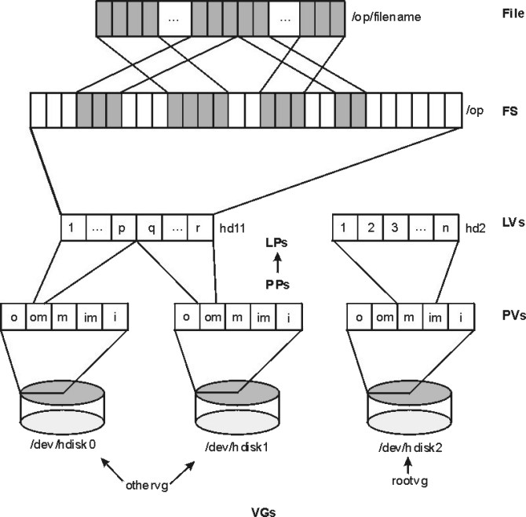

# 用語集

> 掲載：**65 件（v9 で関連用語リンク化）**（定番のみ）。除外項目は [10. 対象外項目](10-out-of-scope.md) を参照。

AIX 管理者として知っておくべき用語のみ。**v9 から「関連用語」列をクリック可能な内部リンクに変換**しています。

## コア OS（4 件）

| 用語 | 定義 | 関連用語 | 関連手順 |
|---|---|---|---|
| **AIX** | Advanced Interactive eXecutive。IBM Power Systems 上で稼働する 64-bit エンタープライズ UNIX OS。System V と BSD の両系譜の機能を統合。 | [POWER](#power), [LPAR](#lpar), [PowerVM](#powervm) |  |
| **POWER** | IBM 製プロセッサアーキテクチャ。AIX 7.3 は POWER8 互換以降のモード（POWER8/9/10/11）が必須。 | [CHRP](#chrp), [AIX](#aix) |  |
| **CHRP** | Common Hardware Reference Platform。POWER 系の共通ハードウェア仕様。AIX が動作する基盤プラットフォーム。 | [POWER](#power), OPAL |  |
| **BLV** | Boot Logical Volume（hd5）。AIX のブートイメージを格納する LV。最小 40 MB、ディスク先頭 4GB 内の連続 PP に配置必須。 | hd5, bosboot, bootlist | [inc-boot-fail-led](09-incident-procedures.md#inc-boot-fail-led) |

## 仮想化（7 件）

| 用語 | 定義 | 関連用語 | 関連手順 |
|---|---|---|---|
| **LPAR** | Logical Partition。PowerVM ハイパーバイザによる論理分割。CPU・メモリ・I/O を分割して複数の独立 OS インスタンスを 1 物理機で稼働。WPAR が「OS の中の OS 隔離」なのに対し、LPAR は「ハードウェア分割」。 | [DLPAR](#dlpar), [PowerVM](#powervm), [WPAR](#wpar), [HMC](#hmc) |  |
| **DLPAR** | Dynamic LPAR。LPAR のリソース（CPU、メモリ、I/O アダプタ）を OS 稼働中に動的に増減する機能。HMC から指示。 | [LPAR](#lpar), [HMC](#hmc), [PowerVM](#powervm) |  |
| **PowerVM** | IBM Power の仮想化ハイパーバイザおよび関連製品群。LPAR, DLPAR, VIOS, LPM 等を提供。AIX はその客 OS。 | [LPAR](#lpar), [VIOS](#vios), [HMC](#hmc), [LPM](#lpm) |  |
| **WPAR** | Workload Partition。AIX の OS レベル仮想化（コンテナ相当）。system WPAR と application WPAR の 2 種。Linux の cgroup/namespace 系より歴史が古い。 | WLM, [LPAR](#lpar) |  |
| **VIOS** | Virtual I/O Server。AIX をベースとした I/O 仮想化専用 LPAR。物理アダプタ（FC/Ethernet）を仮想化して他 LPAR に提供。 | [PowerVM](#powervm), [LPAR](#lpar), vSCSI, NPIV |  |
| **HMC** | Hardware Management Console。Power サーバの管理コンソール。LPAR 構成、DLPAR 操作、Live Partition Mobility、ファームウェア更新を行う。 | [LPAR](#lpar), [DLPAR](#dlpar), [LPM](#lpm) |  |
| **LPM** | Live Partition Mobility。稼働中 LPAR を別 Power 機へ無停止で移動する機能。事前に reserve_policy=no_reserve 等が必要。 | [LPAR](#lpar), [PowerVM](#powervm), [HMC](#hmc) |  |

## カーネル・OS 内部（8 件）

| 用語 | 定義 | 関連用語 | 関連手順 |
|---|---|---|---|
| **ODM** | Object Data Manager。AIX のシステム構成情報（デバイス属性、エラーテンプレート、SRC 設定等）を保持する永続化 DB。Linux の sysfs + udev DB に相当。 | lsattr, chdev, [errnotify](#errnotify) |  |
| **SRC** | System Resource Controller。サブシステム（syslogd、cron、nfsd 等）の起動・停止・監視を一元管理する仕組み。srcmstr デーモンが本体。 | lssrc, startsrc, stopsrc, [srcmstr](#srcmstr) |  |
| **srcmstr** | SRC の親デーモン。inittab から最初に起動され、配下のサブシステム（syslogd, cron, nfsd 等）の管理を引き受ける。 | [SRC](#src), [inittab](#inittab) |  |
| **inittab** | /etc/inittab。init プロセスが boot 時に起動する各種サービスの定義。SysV init 系（systemd 以前）の典型形式。 | init, [srcmstr](#srcmstr) |  |
| **syslogd** | システムロギングデーモン。/etc/syslog.conf に従いカーネル・アプリのログを各出力先に振り分け。 | [errlog](#errlog), /etc/syslog.conf | [cfg-syslog](08-config-procedures.md#cfg-syslog) |
| **errlog** | Error Logging サブシステム本体（/var/adm/ras/errlog）。errdemon が /dev/error を監視して書き込み、errpt で読む。 | errpt, errdemon, [errnotify](#errnotify), [ODM](#odm) | [inc-errpt-hardware-error](09-incident-procedures.md#inc-errpt-hardware-error) |
| **errnotify** | ODM の errnotify クラス。エラーログの label/class/type 一致で外部コマンド（メール通知等）を起動する仕組み。 | [errlog](#errlog), [ODM](#odm) | [cfg-errnotify](08-config-procedures.md#cfg-errnotify) |
| **kdb** | Kernel Debugger。AIX カーネルメモリを dump/dev から検査するためのコマンド。実機 hang や core dump 解析で使用。 | KCT, dump, snap | [inc-core-dump](09-incident-procedures.md#inc-core-dump) |

## ストレージ（14 件）

*図: AIX LVM 階層（File → FS → LV → PP → PV → VG） （出典: AIX 7.3 Performance Management ガイド p.57）*

| 用語 | 定義 | 関連用語 | 関連手順 |
|---|---|---|---|
| **LVM** | Logical Volume Manager。物理ディスク（PV）を VG にまとめ、LV に切り出す抽象化層。AIX の中核ストレージ機能。 | [PV](#pv), [VG](#vg), [LV](#lv), [LP](#lp), [PP](#pp) | [cfg-vg-lv](08-config-procedures.md#cfg-vg-lv) |
| **PV** | Physical Volume。LVM が認識する物理ディスク（hdisk0, hdisk1, ...）。 | [VG](#vg), [PVID](#pvid) | [cfg-disk-add](08-config-procedures.md#cfg-disk-add) |
| **PVID** | Physical Volume ID。PV を一意識別する 16 桁の hex 値。chdev -l hdiskN -a pv=yes で割り当て。 | [PV](#pv), [VGDA](#vgda) | [cfg-disk-add](08-config-procedures.md#cfg-disk-add) |
| **VG** | Volume Group。複数 PV を 1 つの管理単位にまとめたもの。AIX 7.3 既定は scalable VG（1024 PV / 256 LV / 32768 PP）。 | [PV](#pv), [LV](#lv), scalable VG, [VGDA](#vgda), [VGSA](#vgsa) | [cfg-vg-lv](08-config-procedures.md#cfg-vg-lv) |
| **LV** | Logical Volume。VG 内に切り出された論理ボリューム。FS のベースまたは raw（DB raw device 等）。 | [VG](#vg), [LP](#lp), [PP](#pp), [JFS2](#jfs2) | [cfg-vg-lv](08-config-procedures.md#cfg-vg-lv) |
| **LP** | Logical Partition（LV 内の単位）。1 LP = 1〜3 PP（ミラー数による）。LPAR とは別概念。 | [LV](#lv), [PP](#pp), mirror | [cfg-rootvg-mirror](08-config-procedures.md#cfg-rootvg-mirror) |
| **PP** | Physical Partition。VG 作成時に PV 上に切られる固定サイズ（既定 64MB）の単位。 | [PV](#pv), [LP](#lp), [VG](#vg) | [cfg-vg-lv](08-config-procedures.md#cfg-vg-lv) |
| **VGDA** | Volume Group Descriptor Area。VG メタデータの主領域。各 PV の先頭付近に配置。VG メンバー情報、LV 配置等を格納。 | [VG](#vg), [VGSA](#vgsa), [LVCB](#lvcb) |  |
| **VGSA** | Volume Group Status Area。VG 内 PV の状態（active/missing）と PP の状態（stale 等）を保持する領域。 | [VG](#vg), [VGDA](#vgda) |  |
| **LVCB** | Logical Volume Control Block。各 LV の最初の 512 バイトに格納されるメタデータ（LV 名、type、ミラー情報等）。 | [LV](#lv), [VGDA](#vgda) |  |
| **JFS2** | Enhanced Journaled File System。AIX 既定 FS。最大ファイル/FS=128 TB、INLINE log 既定、LV 暗号化対応、snapshot/quota 機能。 | [JFS](#jfs), INLINE log, snapshot | [cfg-fs-extend](08-config-procedures.md#cfg-fs-extend) |
| **JFS** | Journaled File System（旧版、レガシ）。AIX 5L 以前の既定。AIX 7.3 でも作成可能だが新規は JFS2 推奨。 | [JFS2](#jfs2) |  |
| **MPIO** | Multipath I/O。ストレージへの複数パス管理。AIX 7.3 の新規ディスク既定: reserve_policy=no_reserve, algorithm=shortest_queue, queue_depth=64(DS8000)/32(SVC・FlashSystem)。 | reserve_policy, queue_depth | [cfg-mpio-tuning](08-config-procedures.md#cfg-mpio-tuning) |
| **GPFS / Spectrum Scale** | General Parallel File System（現 IBM Spectrum Scale）。HPC・大規模クラスタ向け分散 FS。RSCT VSD/LAPI 廃止後は Spectrum Scale が後継。 | [RSCT](#rsct) |  |

## ネットワーク（8 件）

| 用語 | 定義 | 関連用語 | 関連手順 |
|---|---|---|---|
| **TCP/IP** | AIX のネットワークスタック。BSD 系実装ベース。tcp_sendspace 等の tunable は no コマンドで管理。 | no, ifconfig | [cfg-tcp-buffers](08-config-procedures.md#cfg-tcp-buffers) |
| **NFS** | Network File System。リモート FS 共有プロトコル。AIX 7.3.1+ で 16TB 超ファイル対応。 | nfso, /etc/exports | [cfg-nfs-mount](08-config-procedures.md#cfg-nfs-mount) |
| **SMBFS** | AIX 旧 SMB クライアント FS（SMB 1.0）。後継は SMB Client File System（SMB 2.1 + 3.0.2）。CIFS は AIX 7.3 で Expansion Pack へ移管。 | CIFS, SMB Client FS |  |
| **EtherChannel** | 複数 NIC を 1 論理 NIC に束ねる link aggregation。AIX 独自実装、LACP 互換オプションあり。 | [VLAN](#vlan), NIB | `cfg-etherchannel` |
| **VLAN** | Virtual LAN。1 物理 NIC を 802.1Q tag で複数論理 NIC に分割。 | [EtherChannel](#etherchannel), en, et | `cfg-vlan` |
| **BIND 9.18** | AIX 7.3 同梱の DNS リゾルバ・サーバ実装。bind.rte fileset。bos.net.tcp.bind の後継。 | DNS, /etc/resolv.conf | [cfg-dns](08-config-procedures.md#cfg-dns) |
| **NIM** | Network Installation Management。ネットワーク経由で AIX を集中導入・管理する仕組み。SPOT、LPP_SOURCE、image_data resource を持つ。 | [SPOT](#spot), LPP_SOURCE |  |
| **SPOT** | Shared Product Object Tree。NIM 環境のクライアント用 ramdisk/カーネルイメージ格納領域。 | [NIM](#nim) |  |

## セキュリティ（6 件）

| 用語 | 定義 | 関連用語 | 関連手順 |
|---|---|---|---|
| **RBAC** | Role-Based Access Control。役割（role）と権限（authorization）でアクセス制御。root 権限を細粒度に分割可能。 | [Domain RBAC](#domain-rbac), role, authorization | `cfg-rbac-role` |
| **Domain RBAC** | RBAC の拡張。リソースをドメイン（network、system 等）でグループ化し、ドメイン単位の権限分離が可能。AIX 6.1+ で別機能として並存。 | [RBAC](#rbac) | `cfg-rbac-role` |
| **Trusted Execution** | 実行ファイル整合性検証機能。tepolicies.dat に従い起動時に署名/ハッシュ確認。TL3 SP1 で CHKSHOBJS（共有 .o 検証）追加。 | TSD, AIXPert |  |
| **Trusted AIX** | MAC（Mandatory Access Control）/ MLS（Multi-Level Security）対応の install 時オプション。AIX 7.3 でも `BAS+EAL4+ system configuration` として現存。v3 の「削除済み」記述は誤り。 | BAS+EAL4+, [RBAC](#rbac) |  |
| **PKS** | Platform Keystore。PowerVM 提供の鍵保管領域。AIX Key Manager（pksctl）から利用。暗号化 LV/PV の鍵を保持。 | AIX Key Manager, hdcryptmgr |  |
| **EFS** | Encrypted File System。JFS2 のファイル単位暗号化機能。efsenable で初期化、efskeymgr で鍵管理。 | [JFS2](#jfs2) |  |

## 高可用性（5 件）

| 用語 | 定義 | 関連用語 | 関連手順 |
|---|---|---|---|
| **RSCT** | Reliable Scalable Cluster Technology。クラスタ製品（PowerHA、Spectrum Scale 等）の基盤フレームワーク。AIX 7.3 同梱は 3.3.0.0。VSD/LAPI 機能は廃止。 | [CAA](#caa), [PowerHA](#powerha) |  |
| **CAA** | Cluster Aware AIX。OS レベルクラスタリング機能。Cluster Repository ディスク（NVMe 対応 = TL3 から）でメンバーシップ管理。 | [RSCT](#rsct), [PowerHA](#powerha), clmgr |  |
| **PowerHA** | PowerHA SystemMirror。AIX/Linux の HA クラスタ製品。CAA + RSCT を基盤として動作。 | [CAA](#caa), [RSCT](#rsct) |  |
| **LKU** | Live Kernel Update。業務無停止で AIX カーネルを更新する機能。TL3 で性能改善・blackout 短縮。 | [LLU](#llu), geninstall |  |
| **LLU** | Live Library Update。TL3 新規導入。libc 等のライブラリを業務無停止で更新する機能。 | [LKU](#lku) |  |

## 性能（5 件）

| 用語 | 定義 | 関連用語 | 関連手順 |
|---|---|---|---|
| **VMM** | Virtual Memory Manager。AIX のメモリ管理サブシステム。tunable は vmo コマンドで管理。 | vmo, paging, minperm% | `cfg-vmo-tuning` |
| **vmstat** | 仮想メモリ・CPU・I/O 統計表示コマンド。AIX 性能切り分けの第一歩。`vmstat -v` で詳細メモリ統計。 | [VMM](#vmm), paging | [inc-perf-degradation](09-incident-procedures.md#inc-perf-degradation) |
| **NMON** | Nigel's Performance Monitor。AIX 7.3 base 同梱の性能取得ツール。バッチ取得・CSV 出力対応。 | topas | [inc-perf-degradation](09-incident-procedures.md#inc-perf-degradation) |
| **AIO** | Asynchronous I/O。ノンブロッキング I/O サブシステム。Oracle/Db2 等の DB 性能に直結。aioo / ioo 系の tunable。 | ioo, aio_server_inactivity | `cfg-aio-tuning` |
| **ASO/DSO** | Active System Optimizer / Dynamic System Optimizer。ワークロード自動最適化（large page, prefetch 等）。TL1 以降 DSO は ASO の一部に統合。 | performance |  |

## 管理ツール（2 件）

| 用語 | 定義 | 関連用語 | 関連手順 |
|---|---|---|---|
| **SMIT / smitty** | System Management Interface Tool。AIX 標準のメニュー型管理ツール。smit=X11、smitty=テキスト。/smit.script に実行コマンド履歴。 | [smitty](#smit---smitty), fastpath |  |
| **SMS** | System Management Services。Power サーバのファームウェアメニュー（boot 中に F1/F5/F6 等で進入）。boot 順、ネットワーク boot 等を設定。 | boot, bootlist | [inc-boot-fail-led](09-incident-procedures.md#inc-boot-fail-led) |

## パッケージ（6 件）

| 用語 | 定義 | 関連用語 | 関連手順 |
|---|---|---|---|
| **fileset** | AIX のソフトウェア最小単位。例: bos.rte.commands。複数 fileset で 1 LPP（installp パッケージ）。 | [LPP](#lpp), installp, lslpp | [cfg-package-install](08-config-procedures.md#cfg-package-install) |
| **LPP** | Licensed Program Product。複数 fileset を含むインストール単位。BFF（Backup File Format）形式で配布。 | [fileset](#fileset), BFF, installp | [cfg-package-install](08-config-procedures.md#cfg-package-install) |
| **VRMF** | Version.Release.Modification.Fix。AIX fileset のバージョン形式。例: bos.rte.commands 7.3.4.0。 | [fileset](#fileset), [TL](#tl), [SP](#sp) |  |
| **TL** | Technology Level。AIX のメジャーアップデート単位。AIX 7.3 の最新は TL4（2025-12 リリース）。 | [SP](#sp), [ML](#ml), oslevel |  |
| **SP** | Service Pack。TL の中の累積パッチ。例: TL4 SP1。 | [TL](#tl), oslevel |  |
| **ML** | Maintenance Level。TL の旧称（AIX 5L 以前）。AIX 7.3 では用語として TL に統一。 | [TL](#tl) |  |

---

*出典 ID は [07. 出典一覧](07-sources.md) を参照。*
