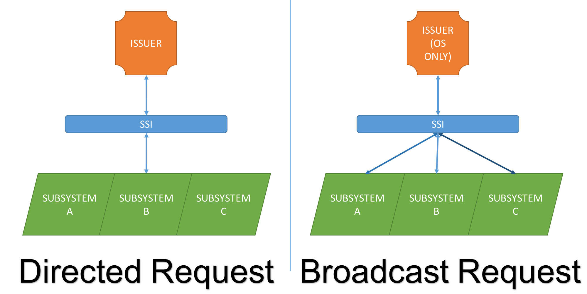
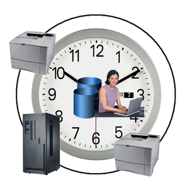
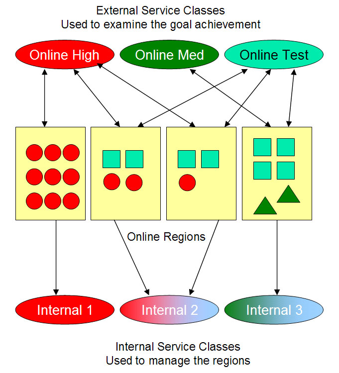
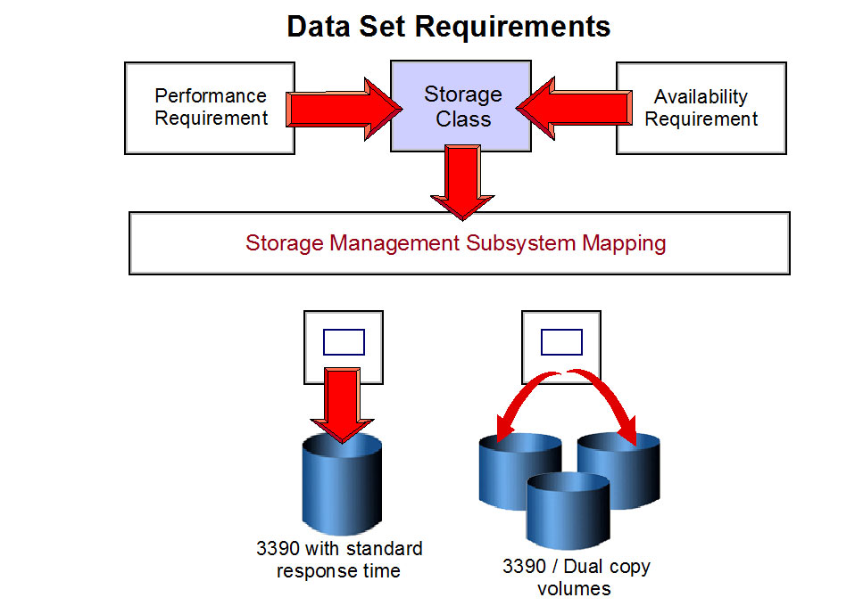

# 設定手順

> 掲載：**18 件（S/A/B/C × 用途、S 級は期待出力サンプル付き）**（定番のみ）。除外項目は [11. 対象外項目](10-out-of-scope.md) を参照。

## 重要度 × 用途 マトリクス

<div class="md-typeset__scrollwrap" markdown="1">

| 重要度＼用途 | DFSMS | JES2 | PARMLIB | RACF | SMF | Sysplex | TCPIP | TSO/E | USS | WLM |
|---|---|---|---|---|---|---|---|---|---|---|
| **S** | — | [cfg-jes2-init](#cfg-jes2-init) | [cfg-parmlib-update](#cfg-parmlib-update)<br>[cfg-stc-startup](#cfg-stc-startup) | [cfg-racf-permit](#cfg-racf-permit) | [cfg-smf-collect](#cfg-smf-collect) | [cfg-sysplex-define](#cfg-sysplex-define) | [cfg-tcpip-profile](#cfg-tcpip-profile) | — | [cfg-uss-fs](#cfg-uss-fs) | [cfg-wlm-policy](#cfg-wlm-policy) |
| **A** | — | — | [cfg-console-add](#cfg-console-add)<br>[cfg-clpa-ipl](#cfg-clpa-ipl)<br>[cfg-apf-add](#cfg-apf-add) | — | — | [cfg-grs-setup](#cfg-grs-setup) | — | — | — | — |
| **B** | [cfg-dataset-mgmt](#cfg-dataset-mgmt)<br>[cfg-sms-class](#cfg-sms-class) | [cfg-jes2-nje](#cfg-jes2-nje) | — | — | — | — | — | [cfg-tso-logon](#cfg-tso-logon) | — | — |
| **C** | — | — | — | — | — | — | — | [cfg-rexx-script](#cfg-rexx-script) | — | — |

</div>

---

## 詳細手順

### cfg-parmlib-update: PARMLIB メンバの更新と反映 { #cfg-parmlib-update }

**重要度**: `S` / **用途**: PARMLIB

**目的**: SYS1.PARMLIB 配下メンバの安全な変更フロー。

**前提**: TSO ユーザに PARMLIB UPDATE 権限。RACF 制御の場合 PERMIT 確認。

**手順**:

1. SYS1.PARMLIB(<member>) を ISPF EDIT でバックアップコピーを取得（例: SYS1.PARMLIB.BAK）
2. 元メンバを編集
3. SET <type>=xx で動的反映可能か確認、可能なら実行
4. 不可な場合は次回 IPL で反映
5. 反映後 D <type> で値確認

**期待出力（実機サンプル）**:

コンソール（D PARMLIB 結果）:
```
RESPONSE=SY1
 IEE251I 14.32.07 PARMLIB DISPLAY 123
 PARMLIB DATA SETS SPECIFIED AT IPL
 ENTRY FLAGS DATA SET NAME                           VOLUME
   1   S    SYS1.PARMLIB                             SYSRES
   2   S    SYS1.IBM.PARMLIB                         SYSRES
```
SET IEASYS=01 成功時:
```
 IEE252I MEMBER IEASYS01 FOUND IN SYS1.PARMLIB
 IEA007I STATIC SYSTEM SYMBOL VALUES 124
   ...（symbol 反映）
```
失敗時に出る代表メッセージ:
- IEE301I PARMLIB MEMBER NOT FOUND（メンバ不在）
- IEA302W PARMLIB SYNTAX ERROR LINE nnnn（構文エラー）

**検証**: コマンド応答で新値、関連サブシステムの動作確認

**ロールバック**: バックアップから元メンバを復元、再度 SET でロールバック

**関連**: [cfg-clpa-ipl](08-config-procedures.md#cfg-clpa-ipl), [inc-ipl-fail](09-incident-procedures.md#inc-ipl-fail)

**出典**: S_ZOS_Init_Tuning

---

### cfg-jes2-init: JES2 INITDECK の修正 { #cfg-jes2-init }

**重要度**: `S` / **用途**: JES2

**目的**: JES2 のジョブクラス・イニシエータ定義変更。

**前提**: MASTER コンソール権限、または RACF JES2.* 権限。

**手順**:

1. INITDECK バックアップ
2. INITDECK 編集（JOBCLASS, INITDEF 等）
3. $T で動的反映可能なものは反映
4. cold start 必須項目は次回 IPL
5. $D <option> で確認

**期待出力（実機サンプル）**:

JES2 cold start 成功時:
```
 $HASP423 SY1     SYS1.HASPACE  CHKPT INITIALIZED
 $HASP493 JES2  COLD START COMPLETE
 $HASP000 JES2 IS ACTIVE
```
$D INITDEF 結果（成功時）:
```
 $HASP824 INITDEF=10
 $HASP822 NUM=10  CLASS=A,B
```
失敗時に出る代表メッセージ:
- $HASP442 JES2 ABENDED（INITDECK 構文エラー）
- $HASP441 REPLY 'Y' OR CANCEL（warm start 確認 WTOR）




*図: JES2 サブシステムへのリクエスト経路（Directed/Broadcast） （出典: ABCs of z/OS Vol.02 (SG24-7977) p.36）*

**検証**: $DA でジョブ動作確認

**ロールバック**: INITDECK 元に戻し、$T で再反映

**関連**: [inc-jes2-spool-full](09-incident-procedures.md#inc-jes2-spool-full)

**出典**: S_ZOS_JES2

---

### cfg-smf-collect: SMF レコード収集設定 { #cfg-smf-collect }

**重要度**: `S` / **用途**: SMF

**目的**: SMFPRMxx の TYPE 指定でレコード収集対象を変更。

**前提**: PARMLIB 編集権限、SMF データセット容量確保。

**手順**:

1. SMFPRMxx バックアップ
2. TYPE() オペランド変更
3. SET SMF=xx で動的反映
4. D SMF で確認

**期待出力**:

```
D SMF が新 TYPE 値表示
```

**検証**: IFASMFDP でレコード抽出、新 type が記録されているか確認

**ロールバック**: SMFPRMxx 元に戻し SET SMF

**関連**: [inc-smf-collect-fail](09-incident-procedures.md#inc-smf-collect-fail)

**出典**: S_ZOS_SMF

---

### cfg-racf-permit: RACF データセット保護とアクセス権付与 { #cfg-racf-permit }

**重要度**: `S` / **用途**: RACF

**目的**: DATASET PROFILE 作成と PERMIT で権限制御。

**前提**: SPECIAL or AUDITOR 権限、または class authority。

**手順**:

1. ADDSD '<dsn>' UACC(NONE) GENERIC で profile 作成
2. PERMIT '<dsn>' ID(<userid>) ACCESS(READ|UPDATE|...) で権限付与
3. SETROPTS GENERIC(DATASET) REFRESH で反映
4. RLIST DATASET '<dsn>' AUTHUSER で確認

**期待出力（実機サンプル）**:

PERMIT 成功時のレスポンス（SDSF / TSO ともに無音 = 成功）。
RLIST で確認:
```
RLIST DATASET 'PROD.PAYROLL.**' AUTHUSER
CLASS      NAME
-----      ----
DATASET    PROD.PAYROLL.** (G)
USER       ACCESS   ACCESS COUNT
----       ------   ------------
PAYUSR     UPDATE        0
```
SETR REFRESH 成功時:
```
 ICH14063I SETROPTS COMMAND COMPLETE.
```
失敗時に出る代表メッセージ:
- ICH06011I RACDEF FUNCTION SUCCESSFUL（実は成功）
- ICH408I INSUFFICIENT AUTHORITY（自分の権限不足、SPECIAL 必要）

**検証**: 対象ユーザでアクセステスト

**ロールバック**: PERMIT '<dsn>' ID(<userid>) DELETE

**関連**: [inc-racf-access-denied](09-incident-procedures.md#inc-racf-access-denied)

**出典**: S_ZOS_RACF

---

### cfg-tcpip-profile: TCPIP PROFILE の更新 { #cfg-tcpip-profile }

**重要度**: `S` / **用途**: TCPIP

**目的**: PROFILE.TCPIP の HOME / PORT / ROUTE 等の変更。

**前提**: TCPIP STC 権限、PROFILE データセット編集権限。

**手順**:

1. PROFILE.TCPIP のバックアップ
2. ステートメント編集
3. VARY TCPIP,,OBEYFILE,'<modified profile>' で動的反映
4. NETSTAT で確認

**期待出力（実機サンプル）**:

V TCPIP,,OBEYFILE 成功時:
```
 EZZ0060I PROCESSING COMMAND: VARY TCPIP,TCPIP,OBEY,USER.OBEY(NEWPROF)
 EZZ0053I COMMAND VARY OBEYFILE COMPLETED SUCCESSFULLY
```
NETSTAT HOME（成功確認）:
```
MVS TCP/IP NETSTAT CS V2R5       TCPIP Name: TCPIP
Home address list:
LinkName: VIPA1     IPv4 Address: 10.0.0.1
LinkName: OSA1      IPv4 Address: 10.0.1.10
```
失敗時に出る代表メッセージ:
- EZZ0050I COMMAND VARY OBEYFILE FAILED（PROFILE 構文エラー）
- EZZ0307I LOST CONNECTION TO TCPIP（STC 異常）

**検証**: ping/telnet で疎通確認

**ロールバック**: OBEYFILE で旧 PROFILE に戻す

**関連**: [inc-tcpip-down](09-incident-procedures.md#inc-tcpip-down)

**出典**: S_ZOS_CommServer

---

### cfg-uss-fs: USS ファイルシステム拡張・追加 { #cfg-uss-fs }

**重要度**: `S` / **用途**: USS

**目的**: zFS aggregate 拡張、または BPXPRMxx に MOUNT 追加。

**前提**: BPXPRMxx 編集権限、zFS データセット作成権限。

**手順**:

1. zfsadm grow -aggregate <name> -size <new size> で aggregate 拡張
2. BPXPRMxx に MOUNT 追加（新規 FS の場合）
3. SET OMVS=xx で動的反映
4. df -k で確認

**期待出力（実機サンプル）**:

zfsadm grow 成功時:
```
IOEZ00099I /sysplex/u GROW completed successfully
```
df -k 確認:
```
Filesystem        1024-blocks      Used  Available Capacity Mounted on
ZFS.U.AGGR1          524288     262144     262144      50%  /u
```
失敗時に出る代表メッセージ:
- IOEZ00043E AGGR_NOT_GROWABLE（aggr が固定サイズ）
- BPXF015I FILE SYSTEM IS FULL


*図: zFS Aggregate と FileSystem の階層 （出典: ABCs of z/OS Vol.09 (SG24-7984) p.315）*

**検証**: ls / touch で書き込みテスト

**ロールバック**: BPXPRMxx 元に戻し SET OMVS、または UNMOUNT

**関連**: [inc-uss-fs-full](09-incident-procedures.md#inc-uss-fs-full)

**出典**: S_ZOS_USS

---

### cfg-sysplex-define: Sysplex / CF 定義 { #cfg-sysplex-define }

**重要度**: `S` / **用途**: Sysplex

**目的**: COUPLExx と CFRM Policy で Sysplex 構成。

**前提**: CDS（Couple Data Set）作成済、CF 構成済。

**手順**:

1. Format CDS（IXCL1DSU）
2. COUPLExx で SYSPLEX 名・CDS 指定
3. CFRM Policy 作成 (IXCMIAPU)
4. SETXCF START で活性化
5. D XCF / D CF で確認

**期待出力**:

```
D XCF,COUPLE で全 CDS active 表示
```




*図: Sysplex CDS（XCF / CFRM / SFM / LOGR / WLM）の役割 （出典: ABCs of z/OS Vol.05 (SG24-7980) p.20）*

**検証**: 全 Sysplex メンバから D XCF が一致

**ロールバック**: SETXCF STOP、別 CDS で再活性化

**関連**: [inc-sysplex-split](09-incident-procedures.md#inc-sysplex-split)

**出典**: S_ZOS_Sysplex

---

### cfg-grs-setup: GRS NONE/RING/STAR モード設定 { #cfg-grs-setup }

**重要度**: `A` / **用途**: Sysplex

**目的**: GRSCNF= で GRS モード変更（IPL 必要）。

**前提**: Sysplex 環境で全メンバ同時 IPL 計画。

**手順**:

1. IEASYSxx の GRS= を変更
2. GRSCNFxx / GRSRNLxx 設定
3. 全 Sysplex メンバ IPL
4. D GRS で STAR 表示確認

**期待出力**:

```
D GRS,A で MODE=STAR 表示
```

**検証**: ENQ/RESERVE 動作確認、IXC117I 等メッセージ無し

**ロールバック**: IEASYSxx 元に戻し IPL（影響大、要計画）

**関連**: [cfg-sysplex-define](08-config-procedures.md#cfg-sysplex-define)

**出典**: S_ZOS_Sysplex

---

### cfg-wlm-policy: WLM Service Policy 修正 { #cfg-wlm-policy }

**重要度**: `S` / **用途**: WLM

**目的**: Service Class / Workload / Goal 変更。

**前提**: WLM 管理者権限、ISPF アクセス。

**手順**:

1. WLM ISPF アプリ起動
2. Service Definition (SCDS) を Read
3. Service Class / Workload / Goal を変更
4. Save / Install (ACDS への反映)
5. POLICY ACTIVATE で動的反映

**期待出力（実機サンプル）**:

WLM POLICY ACTIVATE 成功時:
```
 IWMAM727I WLM POLICY 'STDPOL' ACTIVATED ON SY1
 IWMAM729I PRIOR POLICY 'OLDPOL' DEACTIVATED
```
D WLM,SYSTEMS 確認:
```
RESPONSE=SY1
 IWMSYS001I 14.55.21 WLM DISPLAY 200
 ACTIVE POLICY NAME: STDPOL  ACTIVATED 2026.124 14.55.20
 SYSTEM   STATE     POLICY    DATE/TIME ACTIVATED
 SY1      AVAILABLE STDPOL    2026.124 14.55.20
```
失敗時に出る代表メッセージ:
- IWMAM712I POLICY NOT FOUND IN SCDS
- IWMAM702I ACTIVATE FAILED, RC=08（接続なし or syntax）




*図: WLM External Service Class（Online High/Med/Test）と Internal Service Class（リージョン管理） （出典: ABCs of z/OS Vol.12 (SG24-7987) p.137）*

**検証**: RMF Monitor III で goal 達成率確認

**ロールバック**: 旧 policy version を再 ACTIVATE

**関連**: 

**出典**: S_ZOS_WLM

---

### cfg-stc-startup: Started Task の自動起動設定 { #cfg-stc-startup }

**重要度**: `S` / **用途**: PARMLIB

**目的**: COMMNDxx に START コマンド追加で IPL 時自動起動。

**前提**: PARMLIB 編集権限。

**手順**:

1. COMMNDxx 編集、COM='S TCPIP' 等追加
2. 次回 IPL で自動実行
3. D A,L で起動確認

**期待出力**:

```
D A,L で対象 STC が active
```

**検証**: STC 各サブシステムの動作確認

**ロールバック**: COMMNDxx の該当行をコメントアウト

**関連**: [inc-stc-hung](09-incident-procedures.md#inc-stc-hung)

**出典**: S_ZOS_Init_Tuning

---

### cfg-console-add: Console 追加 (CONSOLxx) { #cfg-console-add }

**重要度**: `A` / **用途**: PARMLIB

**目的**: 新規 MCS / EMCS console を CONSOLxx で定義。

**前提**: MASTER コンソール権限。

**手順**:

1. CONSOLxx 編集（CONSOLE NAME=..., AUTH=..., ROUTCDE=...）
2. SET CON=xx で動的反映
3. D C で表示確認

**期待出力**:

```
D C 出力に新コンソール追加
```

**検証**: 新コンソールから K オペレータコマンドテスト

**ロールバック**: CONSOLxx 元に戻し SET CON

**関連**: [inc-console-hung](09-incident-procedures.md#inc-console-hung)

**出典**: S_ZOS_MVS_Init

---

### cfg-clpa-ipl: CLPA IPL でLPA 再構築 { #cfg-clpa-ipl }

**重要度**: `A` / **用途**: PARMLIB

**目的**: LPALIB 変更後の LPA 再構築。

**前提**: 計画停止時間（IPL 必須）。

**手順**:

1. LPALSTxx を確認
2. IPL 時に LOAD パラメータで CLPA 指定
3. IPL 完了後 D LPA で確認

**期待出力**:

```
D LPA で新モジュール表示
```

**検証**: アプリケーションから LPA モジュール呼び出し動作確認

**ロールバック**: 次回 IPL で CLPA 抜きで起動

**関連**: [cfg-parmlib-update](08-config-procedures.md#cfg-parmlib-update)

**出典**: S_ZOS_Init_Tuning

---

### cfg-apf-add: APF authorized library 追加 { #cfg-apf-add }

**重要度**: `A` / **用途**: PARMLIB

**目的**: PROGxx で APF 認可ライブラリ追加。

**前提**: PARMLIB 編集、ライブラリへのアクセス権。

**手順**:

1. PROGxx に APF ADD DSNAME(<lib>) VOLUME(<vol>) 追加
2. SET PROG=xx で動的反映
3. D PROG,APF で確認

**期待出力**:

```
D PROG,APF 出力に追加ライブラリ表示
```

**検証**: 対象 APF authorized program 実行テスト

**ロールバック**: SETPROG APF DELETE 等で削除

**関連**: [cfg-parmlib-update](08-config-procedures.md#cfg-parmlib-update)

**出典**: S_ZOS_Init_Tuning

---

### cfg-jes2-nje: JES2 NJE ノード追加 { #cfg-jes2-nje }

**重要度**: `B` / **用途**: JES2

**目的**: 他システムへのジョブ転送ルート定義。

**前提**: JES2 設定権限、対向ノード情報。

**手順**:

1. JES2 INITDECK で NODE / NETSRV / LINE 定義
2. JES2 cold/warm start
3. $D NODE で表示確認

**期待出力**:

```
$D NODE 出力に新ノード表示
```

**検証**: /*ROUTE XEQ <node> でテストジョブ転送

**ロールバック**: INITDECK 元に戻し JES2 再起動

**関連**: 

**出典**: S_ZOS_JES2

---

### cfg-tso-logon: TSO LOGON PROC 設定 { #cfg-tso-logon }

**重要度**: `B` / **用途**: TSO/E

**目的**: 新規ユーザの LOGON PROC 設定。

**前提**: RACF TSOPROC 権限。

**手順**:

1. PROCLIB に LOGON PROC member 配置
2. RACF ADDUSER または ALTUSER で TSO セグメントに PROC 指定
3. LOGON でテスト

**期待出力**:

```
LOGON 後 ISPF 起動
```

**検証**: ユーザのテストログオン

**ロールバック**: ALTUSER で旧 PROC 戻し

**関連**: 

**出典**: S_ZOS_TSO

---

### cfg-dataset-mgmt: VSAM cluster の作成 { #cfg-dataset-mgmt }

**重要度**: `B` / **用途**: DFSMS

**目的**: IDCAMS DEFINE で VSAM データセット作成。

**前提**: Catalog 権限、Volume 容量。

**手順**:

1. JCL に IDCAMS step
2. DEFINE CLUSTER NAME(<dsn>) ... INDEXED ...
3. SUBMIT
4. LISTC で確認

**期待出力**:

```
LISTC ENTRIES('<dsn>') で構造表示
```

**検証**: REPRO INFILE/OUTFILE でデータ書き込みテスト

**ロールバック**: DELETE CLUSTER NAME('<dsn>')

**関連**: 

**出典**: S_ZOS_DFSMS

---

### cfg-sms-class: SMS Storage Class / Data Class 追加 { #cfg-sms-class }

**重要度**: `B` / **用途**: DFSMS

**目的**: ISMF で SMS Class 新規追加と ACS routine 修正。

**前提**: ISMF アクセス、SMS 管理者権限。

**手順**:

1. ISMF メニュー → Storage Class 定義
2. ACS routine（Storage Class）に新クラスへの分類追加
3. SCDS validate / activate
4. D SMS で確認

**期待出力**:

```
D SMS,STORCLAS で新クラス表示
```




*図: SMS Storage / Data / Management Class と Storage Group の関係 （出典: ABCs of z/OS Vol.03 (SG24-7978) p.107）*

**検証**: 新規データセット allocate でクラス割当て確認

**ロールバック**: ACS routine 戻し、SCDS 旧 version activate

**関連**: 

**出典**: S_ZOS_DFSMS

---

### cfg-rexx-script: REXX スクリプト配置・実行 { #cfg-rexx-script }

**重要度**: `C` / **用途**: TSO/E

**目的**: TSO/E REXX スクリプトを SYSEXEC 経由で実行可能にする。

**前提**: PDS 配置先への権限。

**手順**:

1. PDS member に REXX 記述
2. ALTLIB ACTIVATE APPLICATION(EXEC) DSNAME('USER01.REXX')
3. % で呼び出し

**期待出力**:

```
% で REXX 実行
```

**検証**: REXX 出力確認

**ロールバック**: ALTLIB DEACTIVATE

**関連**: 

**出典**: S_ZOS_TSO

---

