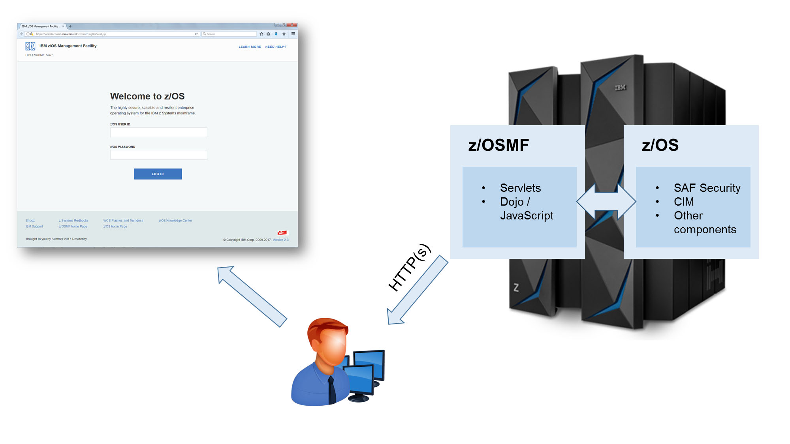

# 障害対応手順

> 掲載：**18 件（S/A/B/C × 用途、S 級は A/B/C 仮説分岐付き）**（定番のみ）。除外項目は [11. 対象外項目](10-out-of-scope.md) を参照。

## 重要度 × 用途 マトリクス

<div class="md-typeset__scrollwrap" markdown="1">

| 重要度＼用途 | DFSMS | JES2 | Sysplex | USS | コンソール | ジョブ | セキュリティ | ソフトウェア管理 | ネットワーク | ログ監査 | 性能 | 起動停止 |
|---|---|---|---|---|---|---|---|---|---|---|---|---|
| **S** | — | [inc-jes2-spool-full](#inc-jes2-spool-full) | [inc-sysplex-split](#inc-sysplex-split) | [inc-uss-fs-full](#inc-uss-fs-full) | — | [inc-job-abend](#inc-job-abend) | [inc-racf-access-denied](#inc-racf-access-denied) | — | [inc-tcpip-down](#inc-tcpip-down) | — | [inc-paging-shortage](#inc-paging-shortage) | [inc-ipl-fail](#inc-ipl-fail)<br>[inc-system-hung](#inc-system-hung)<br>[inc-wtor-response](#inc-wtor-response)<br>[inc-stc-hung](#inc-stc-hung) |
| **A** | [inc-vsam-open-fail](#inc-vsam-open-fail) | — | — | — | [inc-console-hung](#inc-console-hung) | [inc-job-fail](#inc-job-fail) | — | [inc-smpe-apply-fail](#inc-smpe-apply-fail) | — | [inc-smf-collect-fail](#inc-smf-collect-fail)<br>[inc-syslog-investigation](#inc-syslog-investigation) | — | — |
| **B** | — | — | — | [inc-uss-batch](#inc-uss-batch) | — | — | — | — | — | — | — | — |
| **C** | — | — | — | — | — | — | — | — | — | — | — | — |

</div>

---

## 詳細手順

### inc-ipl-fail: IPL 失敗・hang { #inc-ipl-fail }

**重要度**: `S` / **用途**: 起動停止

**目的**: z/OS が IPL 中で進まない、または NIP で停止する場合の切り分け。

**前提**: HMC アクセス、別 LOADxx での IPL 計画。

**仮説分岐（切り分けの第一歩）**:

_トリガ事象_: z/OS が IPL 中で進まない、NIP メッセージで停止

| 仮説 | 内容 | 見分け方 | 対応 |
|---|---|---|---|
| **A** | PARMLIB の構文エラー / 値矛盾 | IEA301I / IEA302W / IEE254I 等の構文エラーメッセージが NIP に出ている | 別 LOADxx で IPL → 該当メンバを ISPF EDIT → 構文修正 → 再 IPL |
| **B** | IODF / I/O 構成の不整合 | IOS001E / IOS118E / IGD002I 等の I/O メッセージが出る、または特定デバイスが OFFLINE | 別 IODF（前世代）で IPL → HCD で IODF 修正 → ACTIVATE → 再 IPL |
| **C** | Master Catalog 損傷 / SYSRES アクセス不能 | IEA083E / IGW01001I 等のカタログ／VSAM エラー | Stand-Alone Restore で SYSRES 復元 → Master Catalog を IDCAMS REPRO で再構築 → IPL |

_共通の最初の動作_: HMC コンソールで NIP メッセージを必ず記録（後の解析の根拠）。

**手順（共通）**:

1. HMC コンソールで NIP メッセージ記録
2. WTOR があれば適切に応答（R 0, NORESEXIT 等）
3. 進まなければ別 LOADxx で IPL
4. 別 IODF で IPL
5. mksysb 相当の Stand-Alone Restore 検討

**期待出力**:

```
NIP 完了、サブシステム起動完了
```


*図: z/OS の起動シーケンス（IPL → NIP → MVS startup）— 失敗箇所特定の参考 （出典: ABCs of z/OS Vol.01 (SG24-7976) p.37）*

**検証**: D IPLINFO で状態、D A,L で全 STC active

**ロールバック**: 事前バックアップ済 PARMLIB から復元

**関連**: [cfg-parmlib-update](08-config-procedures.md#cfg-parmlib-update)

**出典**: S_ZOS_MVS_Init

---

### inc-system-hung: システム hung（応答なし） { #inc-system-hung }

**重要度**: `S` / **用途**: 起動停止

**目的**: z/OS 全体応答なし、コンソール反応なしの対応。

**前提**: HMC アクセス。

**仮説分岐（切り分けの第一歩）**:

_トリガ事象_: z/OS 全体応答なし、コンソール反応なし

| 仮説 | 内容 | 見分け方 | 対応 |
|---|---|---|---|
| **A** | リソース枯渇（CSA/ECSA/SQA/Aux Storage） | hung 直前に IRA200E / ILR005E / IEA602I などの容量警告が記録されている | Stand-Alone Dump → IPCS で消費 Address Space 特定 → 該当 STC 殺害 → 再 IPL 後 IEASYSxx で増量 |
| **B** | デッドロック（GRS / Db2 / IMS） | D GRS,C で contention 多数、または特定 STC が長時間 WAIT | D GRS,SYSTEM,LATCH で latch holder 特定 → C/CANCEL ARM=YES で release → 必要なら SVC dump |
| **C** | ハードウェア障害（CPU / メモリ / CF link） | HMC SE で hardware error log（PCHID error 等）が出ている | HMC で hardware status 確認 → IBM ハードウェアサポートへ。回避は別 LPAR への workload 移動 |

_共通の最初の動作_: HMC で SVC dump（SYSTEM RESET → SADMP）を必ず取得してから再 IPL。

**手順（共通）**:

1. HMC で SVC dump 取得（SYSTEM RESET → SADUMP）
2. SVC dump を IPCS で解析
3. 強制再 IPL
4. dump を IBM サポート提供

**期待出力**:

```
再 IPL 後システム回復
```

**検証**: D A,L で正常状態、エラー再発なし

**ロールバック**: （hang は復旧手段、rollback なし）

**関連**: [inc-paging-shortage](09-incident-procedures.md#inc-paging-shortage)

**出典**: S_ZOS_Diag

---

### inc-wtor-response: WTOR 大量蓄積対応 { #inc-wtor-response }

**重要度**: `S` / **用途**: 起動停止

**目的**: 未応答 WTOR が多数蓄積した状態の整理。

**前提**: MASTER コンソール権限。

**手順（共通）**:

1. D R,L で全 WTOR 表示
2. 各 ID のメッセージ意味を IBM Docs 参照
3. 適切な reply (R <id>,<reply>)
4. D R で残数確認

**期待出力**:

```
D R,L で WTOR 数 0
```

**検証**: システムが進む、D A,L で active 増加

**ロールバック**: （応答済 WTOR は復元不可）

**関連**: 

**出典**: S_ZOS_MVS_Cmds

---

### inc-jes2-spool-full: JES2 SPOOL 95% SHORT 対応 { #inc-jes2-spool-full }

**重要度**: `S` / **用途**: JES2

**目的**: $HASP050 SHORT ON SPOOL SPACE 発生時の対応。

**前提**: JES2 オペレータ権限。

**仮説分岐（切り分けの第一歩）**:

_トリガ事象_: $HASP050 SHORT ON SPOOL SPACE 発生、新規ジョブ受付不能

| 仮説 | 内容 | 見分け方 | 対応 |
|---|---|---|---|
| **A** | 完了済ジョブの蓄積（HOLD class 等で purge されていない） | $D Q で大量の OUTPUT/HOLD ジョブ、SDSF H で hold 数が多い | SDSF ST → 不要ジョブ P でパージ。SDSF H → P で hardcopy パージ。$T <CLASS>,OUTPUT=PURGE で自動化検討 |
| **B** | 暴走ジョブによる SYSOUT 大量出力 | $D Q で特定ジョブの SYSOUT サイズが異常 | $C <jobid> でジョブキャンセル → SYSOUT パージ → アプリケーション側で OUTLIM 等の上限設定 |
| **C** | SPOOL volume 容量設計の限界 | $D SPL で全 volume の利用率が均等に高い、定常状態での増加 | $T SPOOL ADD で新規 SPOOL volume 追加（DASD 事前確保必要）。中長期で cold start で SPOOLDEF 拡張 |

_共通の最初の動作_: $D Q で総合状況、$D SPL で volume 別利用率を最初に必ず確認。

**手順（共通）**:

1. $D Q で使用率確認
2. SDSF ST → 完了済ジョブを P でパージ
3. SDSF H → HARDCOPY を P
4. それでも不足なら $T SPOOL ADD で新規 volume 追加
5. $D Q で改善確認

**期待出力**:

```
使用率 80% 以下に低下
```


*図: JES2 SPOOL volume と CHKPT の構造（SHORT 発生時の参考） （出典: ABCs of z/OS Vol.02 (SG24-7977) p.162）*

**検証**: $HASP050 メッセージ消失、新規ジョブ受付可能

**ロールバック**: （パージ済ジョブは復元不可、SPOOL 追加のみ rollback 可）

**関連**: [cfg-jes2-init](08-config-procedures.md#cfg-jes2-init)

**出典**: S_ZOS_JES2

---

### inc-job-abend: ジョブ ABEND 解析 { #inc-job-abend }

**重要度**: `S` / **用途**: ジョブ

**目的**: S0C4/S0C7/S322/B37 等の ABEND 原因解析。

**前提**: SDSF アクセス、IPCS 権限。

**手順（共通）**:

1. SDSF ST → S でジョブ詳細表示
2. JESJCL/JESYSMSG/SYSOUT で ABEND コードと位置確認
3. SVC dump があれば IPCS で解析
4. 原因に応じて JCL or アプリ修正
5. $E で再実行

**期待出力**:

```
再実行で正常終了
```

**検証**: RC=0 または期待 RC、SYSOUT で出力確認

**ロールバック**: （ABEND の rollback は再実行）

**関連**: [inc-vsam-open-fail](09-incident-procedures.md#inc-vsam-open-fail)

**出典**: S_ZOS_Diag

---

### inc-paging-shortage: ページング枯渇 (ILR005E) { #inc-paging-shortage }

**重要度**: `S` / **用途**: 性能

**目的**: PLPA/COMMON/LOCAL ページデータセット使用率超過対応。

**前提**: ASM 操作権限。

**仮説分岐（切り分けの第一歩）**:

_トリガ事象_: ILR005E AUXILIARY STORAGE SHORTAGE

| 仮説 | 内容 | 見分け方 | 対応 |
|---|---|---|---|
| **A** | メモリリーク STC が大量 paging を発生させている | D ASM,PLPA で PLPA は正常、LOCAL のみ高使用。RMF Mon III で特定 ASID が常に high working set | 該当 STC を P で停止 → 起動元の保守 PTF 確認 |
| **B** | 突発負荷で正常なバッチが paging を引き起こす | JES2 で同時 active job 数が異常に多い | $P INIT で initiator 数を一時減少 → 完了待ち → 段階的に復帰 |
| **C** | ページデータセット容量設計不足 | D ASM で全タイプ（PLPA/COMMON/LOCAL）が定常的に高使用率 | PAGEADD で新規 LOCAL ページデータセット動的追加 → 中長期で IEASYSxx PAGE= 拡張 |

_共通の最初の動作_: D ASM で各タイプ（PLPA/COMMON/LOCAL）の使用率を必ず確認してから手段選択。

**手順（共通）**:

1. D ASM で各タイプ使用率確認
2. PAGEADD で動的に追加 (LOCAL のみ)
3. 不要 STC を P で停止
4. システムワーキングセット見直し

**期待出力**:

```
D ASM で使用率低下
```




*図: z/OS 仮想記憶（Common / Private）— ページング枯渇切り分けの参考 （出典: ABCs of z/OS Vol.01 (SG24-7976) p.29）*

**検証**: ILR005E メッセージ消失、新規アドレス空間起動可能

**ロールバック**: PAGEADD は PAGEDEL で取り外し可能

**関連**: [inc-system-hung](09-incident-procedures.md#inc-system-hung)

**出典**: S_ZOS_Init_Tuning

---

### inc-racf-access-denied: RACF アクセス拒否 (ICH408I) { #inc-racf-access-denied }

**重要度**: `S` / **用途**: セキュリティ

**目的**: RACF でアクセス拒否された場合の権限調整。

**前提**: RACF SPECIAL or class authority。

**仮説分岐（切り分けの第一歩）**:

_トリガ事象_: ICH408I INSUFFICIENT ACCESS AUTHORITY

| 仮説 | 内容 | 見分け方 | 対応 |
|---|---|---|---|
| **A** | プロファイルに対する権限不足（PERMIT 不在） | RLIST <class> '<profile>' AUTHUSER で対象ユーザの ACCESS 列が NONE / READ 不足 | PERMIT '<profile>' CLASS(<class>) ID(<user>) ACCESS(<level>) → SETR REFRESH |
| **B** | プロファイル自体がない（UACC NONE 状態） | RLIST <class> '<profile>' で NOT FOUND | RDEFINE <class> '<profile>' UACC(NONE) AUDIT(SUCCESS,FAILURES) → PERMIT で個別権限 |
| **C** | GENERIC プロファイルの REFRESH 漏れ | PERMIT 直後で SETR REFRESH 未実施、GENERIC class（DATASET 等）で発生 | SETROPTS GENERIC(<class>) REFRESH → 再アクセステスト |

_共通の最初の動作_: ICH408I のメッセージ全文（ENTITY/CLASS/ACCESS）を必ず保存してから RLIST 開始。

**手順（共通）**:

1. ICH408I メッセージで対象リソース・ユーザ確認
2. RLIST <class> '<profile>' AUTHUSER で現状確認
3. 必要なら PERMIT で権限付与
4. SETROPTS REFRESH（class が GENERIC 等の場合）
5. 再アクセステスト

**期待出力**:

```
ユーザがアクセス成功
```

**検証**: ICH408I 再発なし

**ロールバック**: PERMIT ... DELETE で取り消し

**関連**: [cfg-racf-permit](08-config-procedures.md#cfg-racf-permit)

**出典**: S_ZOS_RACF

---

### inc-smf-collect-fail: SMF レコード取得失敗 { #inc-smf-collect-fail }

**重要度**: `A` / **用途**: ログ監査

**目的**: SMF データセット FULL や TYPE 漏れで取得不全の対応。

**前提**: SMF 操作権限。

**手順（共通）**:

1. D SMF で現状確認
2. SYS1.MAN1/2/3 が FULL なら SWITCH SMF で次データセットへ
3. IFASMFDP でフルデータセットを history へ
4. SETSMF TYPE(...) で TYPE 追加

**期待出力**:

```
D SMF で正常状態、新レコード書き込み開始
```

**検証**: IFASMFDP で新レコード抽出確認

**ロールバック**: SMFPRMxx 元に戻し SET SMF

**関連**: [cfg-smf-collect](08-config-procedures.md#cfg-smf-collect)

**出典**: S_ZOS_SMF

---

### inc-sysplex-split: Sysplex 分断 (XCF 通信断) { #inc-sysplex-split }

**重要度**: `S` / **用途**: Sysplex

**目的**: Sysplex メンバ間の通信断の対応。

**前提**: Sysplex 全体構成把握、SFM Policy。

**手順（共通）**:

1. D XCF,COUPLE で各 CDS 状態
2. D XCF,GROUP / D XCF,POLICY で構成確認
3. SFM Policy が active なら自動隔離
4. 手動で SETXCF FORCE でメンバ切り離し
5. 復旧後 SETXCF START で再参加

**期待出力**:

```
D XCF で全メンバ ACTIVE
```


*図: Parallel Sysplex の構成（XCF 通信断時の影響範囲確認） （出典: ABCs of z/OS Vol.05 (SG24-7980) p.18）*

**検証**: Sysplex 全体動作確認

**ロールバック**: （自動回復、rollback なし）

**関連**: [cfg-sysplex-define](08-config-procedures.md#cfg-sysplex-define)

**出典**: S_ZOS_Sysplex

---

### inc-tcpip-down: TCP/IP 通信不能 { #inc-tcpip-down }

**重要度**: `S` / **用途**: ネットワーク

**目的**: TCPIP STC 異常で外部通信できない場合の対応。

**前提**: TCPIP / NETSTAT 権限。

**仮説分岐（切り分けの第一歩）**:

_トリガ事象_: TCP/IP 通信不能、ping 失敗

| 仮説 | 内容 | 見分け方 | 対応 |
|---|---|---|---|
| **A** | TCPIP STC 自体が down/hung | D A,L で TCPIP が ACTIVE でない、または応答なし | TCPIP STC を P → S で再起動。hung なら C → S。NETSTAT 取得不能で確認 |
| **B** | ネットワークインターフェース（OSA/HiperSocket）障害 | NETSTAT DEV で OSA インターフェースが INACTIVE / NOT ACTIVE | VARY OBEY で device 再活性化、HMC で OSA hardware status 確認 |
| **C** | PROFILE.TCPIP 設定誤り（HOME / ROUTE / GATEWAY） | NETSTAT HOME で HOME IP 不在、NETSTAT ROUTE で default route 不在 | PROFILE.TCPIP 修正 → V TCPIP,,OBEYFILE で動的反映 → ping 再試行 |

_共通の最初の動作_: NETSTAT HOME / NETSTAT DEV / NETSTAT ROUTE の 3 点をまず取得。

**手順（共通）**:

1. D A,L で TCPIP STC 状態確認
2. NETSTAT HOME / NETSTAT DEV で IP/インターフェース確認
3. PROFILE.TCPIP の最新化確認
4. TCPIP STC を P → S で再起動
5. ping で疎通確認

**期待出力**:

```
ping 成功、NETSTAT 正常
```

**検証**: 外部システムからの接続テスト

**ロールバック**: PROFILE.TCPIP を旧版に戻し再起動

**関連**: [cfg-tcpip-profile](08-config-procedures.md#cfg-tcpip-profile)

**出典**: S_ZOS_CommServer

---

### inc-uss-fs-full: USS ファイルシステム満杯 { #inc-uss-fs-full }

**重要度**: `S` / **用途**: USS

**目的**: zFS aggregate 満杯時の対応。

**前提**: BPXPRMxx 権限、zFS 管理権限。

**手順（共通）**:

1. df -k で対象 FS 確認
2. 不要ファイル削除
3. zfsadm grow で拡張
4. df -k で確認

**期待出力**:

```
df -k で空き容量回復
```


*図: zfsadm grow による zFS aggregate 拡張 （出典: ABCs of z/OS Vol.09 (SG24-7984) p.703）*

**検証**: ファイル書き込みテスト

**ロールバック**: zfsadm shrink（縮小）

**関連**: [cfg-uss-fs](08-config-procedures.md#cfg-uss-fs)

**出典**: S_ZOS_USS

---

### inc-stc-hung: STC hung { #inc-stc-hung }

**重要度**: `S` / **用途**: 起動停止

**目的**: Started Task が応答なくなった場合の対応。

**前提**: MASTER コンソール権限、DUMP 取得権限。

**手順（共通）**:

1. SDSF DA → S でジョブ詳細
2. DUMP COMM=(<text>),JOBNAME=<jobname> で SVC dump
3. P <jobname> で正常停止試行
4. 効かなければ C <jobname>
5. dump を IPCS で解析

**期待出力**:

```
STC が停止、再起動可能
```

**検証**: S <procname> で正常起動

**ロールバック**: （hung の rollback はない）

**関連**: [inc-system-hung](09-incident-procedures.md#inc-system-hung)

**出典**: S_ZOS_Diag

---

### inc-vsam-open-fail: VSAM open エラー (IDC3009I) { #inc-vsam-open-fail }

**重要度**: `A` / **用途**: DFSMS

**目的**: VSAM cluster open 失敗の原因切り分け。

**前提**: Catalog/VSAM 操作権限。

**手順（共通）**:

1. メッセージ ID で原因確認（return/reason code）
2. LISTC LEVEL(<dsn>) で構造確認
3. EXAMINE で整合性チェック
4. REPRO で再作成、または ALTER で属性修正

**期待出力**:

```
open 成功
```

**検証**: アプリから読み書きテスト

**ロールバック**: バックアップから restore

**関連**: [inc-job-abend](09-incident-procedures.md#inc-job-abend)

**出典**: S_ZOS_DFSMS

---

### inc-syslog-investigation: SYSLOG/OPERLOG 調査 { #inc-syslog-investigation }

**重要度**: `A` / **用途**: ログ監査

**目的**: システムメッセージから障害原因特定。

**前提**: SDSF アクセス。

**手順（共通）**:

1. SDSF LOG（または LOG O で OPERLOG）
2. FIND <message id> で該当箇所探す
3. 前後の関連メッセージ確認
4. 必要なら IPCS で SVC dump 解析

**期待出力**:

```
原因メッセージ特定
```

**検証**: 対処後にエラーメッセージ消失

**ロールバック**: （調査作業に rollback なし）

**関連**: 

**出典**: S_ZOS_SDSF

---

### inc-console-hung: Console 応答なし { #inc-console-hung }

**重要度**: `A` / **用途**: コンソール

**目的**: MCS console hung 時の代替対応。

**前提**: 代替コンソールアクセス、HMC。

**手順（共通）**:

1. 別 console から D C で console 状態確認
2. VARY CN(<console>),OFFLINE で切り離し
3. VARY CN(<alt>),HARDCPY で代替指定
4. EMCS console で代替

**期待出力**:

```
代替 console が active
```

**検証**: オペレータコマンド受付

**ロールバック**: VARY CN(<original>),ONLINE で戻し

**関連**: [cfg-console-add](08-config-procedures.md#cfg-console-add)

**出典**: S_ZOS_MVS_Init

---

### inc-smpe-apply-fail: SMP/E APPLY 失敗 { #inc-smpe-apply-fail }

**重要度**: `A` / **用途**: ソフトウェア管理

**目的**: PTF 適用失敗の原因切り分け。

**前提**: SMP/E 操作権限。

**手順（共通）**:

1. APPLY 出力ログ確認
2. ++HOLD 警告確認
3. 不足 prerequisite を特定
4. APPLY GROUPEXTEND で関連 PTF 同時適用
5. BYPASS(HOLDSYS) は内容確認後に判断

**期待出力**:

```
APPLY SUCCESS
```

**検証**: LIST SYSMOD で適用状態確認、システム動作確認

**ロールバック**: RESTORE で取り消し

**関連**: [cfg-parmlib-update](08-config-procedures.md#cfg-parmlib-update)

**出典**: S_ZOS_SMPE

---

### inc-job-fail: ジョブ失敗・再実行 { #inc-job-fail }

**重要度**: `A` / **用途**: ジョブ

**目的**: JES2 で failed/canceled ジョブの再実行。

**前提**: JES2 操作権限。

**手順（共通）**:

1. SDSF ST で対象ジョブ確認
2. JESYSMSG で失敗原因
3. JCL 修正後 SUBMIT、または CKPT があれば $E で restart
4. 再実行確認

**期待出力**:

```
再実行で RC=0
```

**検証**: 出力確認

**ロールバック**: （失敗ジョブの rollback はない）

**関連**: [inc-job-abend](09-incident-procedures.md#inc-job-abend)

**出典**: S_ZOS_JES2

---

### inc-uss-batch: BPXBATCH 失敗対応 { #inc-uss-batch }

**重要度**: `B` / **用途**: USS

**目的**: BPXBATCH ジョブ失敗の切り分け。

**前提**: BPXBATCH JCL 編集権限。

**手順（共通）**:

1. STDOUT / STDERR DD 確認
2. シェルスクリプト権限確認 (chmod +x)
3. シェルパス確認 (#!/bin/sh)
4. 環境変数（PATH 等）確認

**期待出力**:

```
BPXBATCH RC=0
```

**検証**: STDOUT 出力確認

**ロールバック**: （バッチ実行の rollback はない）

**関連**: [cfg-uss-fs](08-config-procedures.md#cfg-uss-fs)

**出典**: S_ZOS_USS

---

