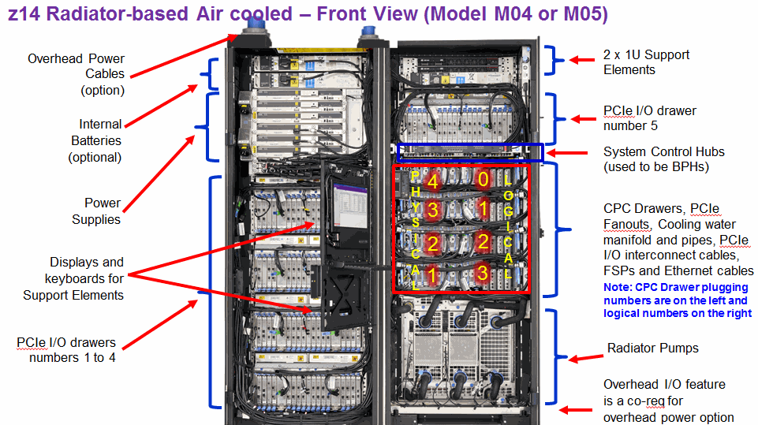
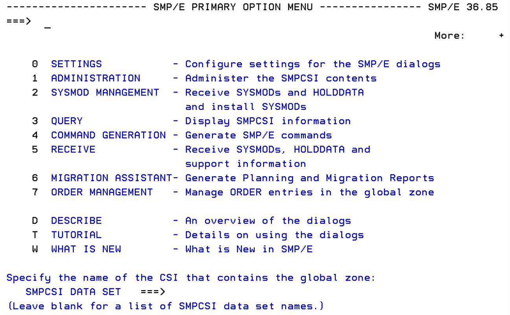
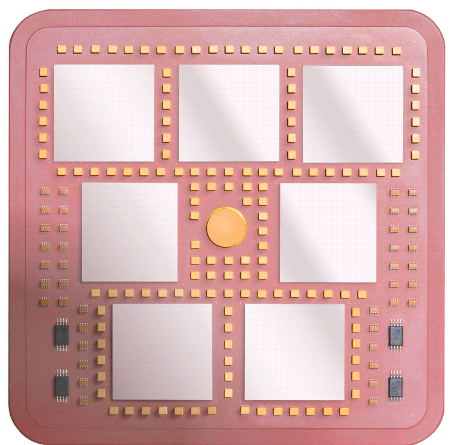
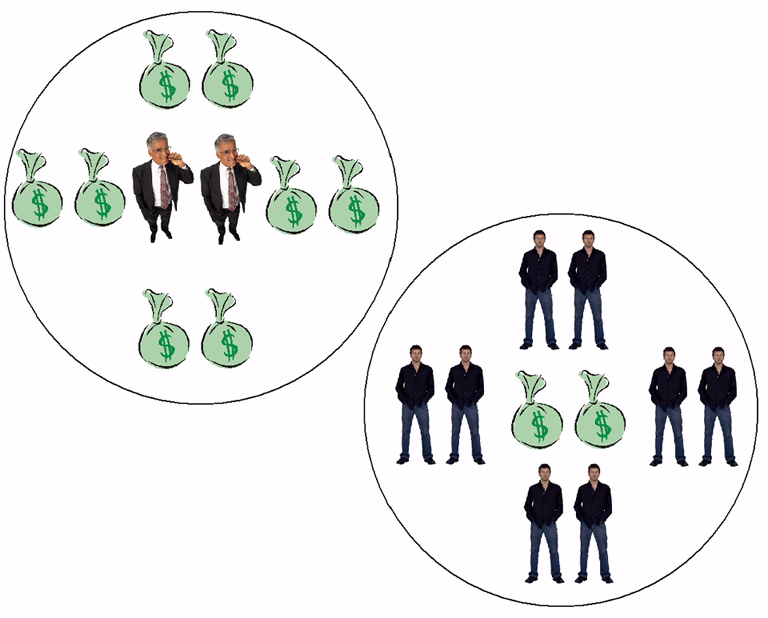
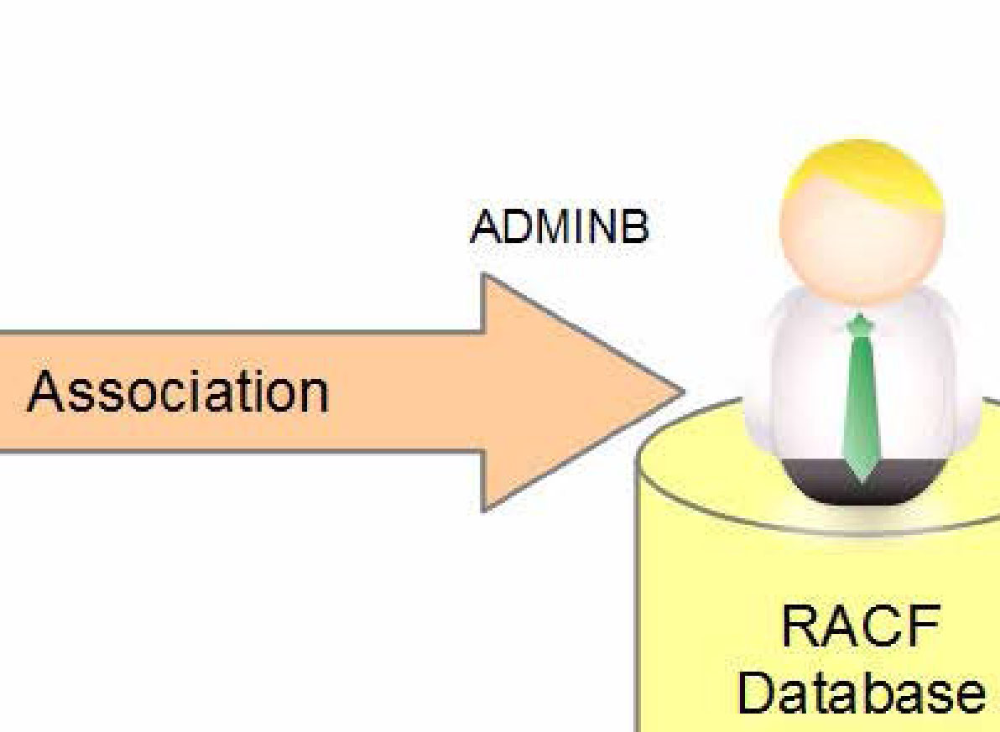

# シナリオ別ガイド

> 業務全体のイメージから入りたい読者向け。各シナリオは典型的な業務状況と、関連するユースケース・手順への組み合わせ案内。

**他章との関係**:
- **本章（11. シナリオ別ガイド）**: meta レベル、業務全体の俯瞰
- **[13. ユースケース集](12-use-cases.md)**: 各ユースケースは独立完結、拾い読み可能
- 1 シナリオから複数ユースケースへリンク（1:N）

**収録シナリオ**: 6 本

| ID | タイトル | 概要 |
|---|---|---|
| [scn-new-system-init](#scn-new-system-init) | 新規 z/OS システムの初期セットアップ | 新しい LPAR を初めて立ち上げて運用に乗せるまでの全体俯瞰。 |
| [scn-spool-shortage](#scn-spool-shortage) | JES2 SPOOL 容量不足対応 | $HASP050 SHORT ON SPOOL SPACE 発生時の即時対応 + 恒久対策。 |
| [scn-perf-investigation](#scn-perf-investigation) | 性能問題の切り分けと改善 | 業務応答悪化時に WLM/RMF から原因特定して tunable 調整するまで。 |
| [scn-disaster-recovery](#scn-disaster-recovery) | 災害復旧（DR）演習・準備 | GDPS / Sysplex / mksysb 相当の Stand-Alone Restore による DR 演習。 |
| [scn-security-audit](#scn-security-audit) | セキュリティ監査要求への対応 | 監査要求（誰が何にアクセスしたか）への RACF + SMF を活用した対応。 |
| [scn-software-maint](#scn-software-maint) | z/OS パッチ適用（PTF / Service Pack） | SMP/E でのパッチ適用、テスト、ロールバックまでの全体フロー。 |

!!! info "本章の品質方針"
    全シナリオは IBM z/OS 公式マニュアル記載の事実・手順のみで構成。AI が苦手な定性的判断（ベストプラクティス、経験則）は範囲外。

---

## 新規 z/OS システムの初期セットアップ { #scn-new-system-init }

**概要**: 新しい LPAR を初めて立ち上げて運用に乗せるまでの全体俯瞰。

## シナリオの状況

新規 LPAR が割当てられ、z/OS 3.1 を IPL したばかり。これから業務利用に向けて以下を順次設定する必要がある。

## 推奨フロー（参照ユースケース）

### Phase 1: 基本設定
1. **シンボル定義** → [uc-parmlib-iea-symdef](12-use-cases.md#uc-parmlib-iea-symdef)
   - Sysplex / システム別の共通シンボル設定
2. **APF 認可ライブラリ** → [uc-parmlib-progxx-apf](12-use-cases.md#uc-parmlib-progxx-apf)
   - 業務製品ライブラリの APF 追加
3. **サブシステム追加** → [uc-parmlib-iefssn](12-use-cases.md#uc-parmlib-iefssn)
   - RRS, ICSF 等の追加

### Phase 2: ネットワーク・リソース
4. **TCPIP HOME 設定** → [uc-tcpip-home-add](12-use-cases.md#uc-tcpip-home-add)
5. **TCPIP PORT 予約** → [uc-tcpip-port-reserve](12-use-cases.md#uc-tcpip-port-reserve)
6. **Console 追加** → cfg-console-add（08章）

### Phase 3: ストレージ・USS
7. **zFS マウント定義** → [uc-parmlib-bpx-mount](12-use-cases.md#uc-parmlib-bpx-mount)
8. **VSAM 業務 dataset** → [uc-vsam-define](12-use-cases.md#uc-vsam-define)
9. **SMS Storage Class** → [uc-sms-class-add](12-use-cases.md#uc-sms-class-add)

### Phase 4: セキュリティ
10. **RACF データセット保護** → [uc-racf-dataset-profile](12-use-cases.md#uc-racf-dataset-profile)
11. **OMVS セグメント** → [uc-uss-omvs-segment](12-use-cases.md#uc-uss-omvs-segment)
12. **FACILITY クラス** → [uc-racf-fac-class](12-use-cases.md#uc-racf-fac-class)

### Phase 5: ジョブ管理
13. **JES2 JOBCLASS** → [uc-jes2-jobclass-define](12-use-cases.md#uc-jes2-jobclass-define)
14. **STC 自動起動** → [uc-stc-autostart](12-use-cases.md#uc-stc-autostart)

### Phase 6: 監視・統計
15. **SMF レコード設定** → [uc-parmlib-smfprm-add-type](12-use-cases.md#uc-parmlib-smfprm-add-type)
16. **SMF 自動 SWITCH** → [uc-smf-switch-dump](12-use-cases.md#uc-smf-switch-dump)

## ポイント

各 Phase 完了後に `D IPLINFO`、`D PARMLIB`、`D SMS`、`D TCPIP`、`SETROPTS LIST` 等で設定を確認。

### 関連図表

*図: z/OS の起動シーケンス（IPL → NIP → MVS startup）の概念 （出典: ABCs of z/OS Vol.01 (SG24-7976) p.37）*

*図: z/OS SSI（JESCT → SSCVT → SSVT）の Master Scheduler / JES2 / 他サブシステム呼び出し構造 （出典: ABCs of z/OS Vol.02 (SG24-7977) p.37）*

*図: z14 メインフレーム前面構造（M04/M05 モデル）— IPL のハードウェアコンテキスト （出典: ABCs of z/OS Vol.10 (SG24-7985) p.103）*

---

## 本記事の範囲

**本記事の範囲**: z/OS 新規 LPAR の初回 IPL までの PARMLIB 最低限セットを扱う。I/O 構成定義（HCD/IODF）はサイト固有のため別途 ABCs Vol.10 を参照。IBM Z ハードウェア（CPC/LPAR）の物理構成は対象外。

AI が苦手な定性的判断（ベストプラクティス、経験的な判断基準、運用ノウハウ）は範囲外で、経験ある SME（Subject Matter Expert）または IBM サポートにご確認ください。

---

## JES2 SPOOL 容量不足対応 { #scn-spool-shortage }

**概要**: $HASP050 SHORT ON SPOOL SPACE 発生時の即時対応 + 恒久対策。

## シナリオの状況

$HASP050 SHORT ON SPOOL SPACE メッセージが発生し、SPOOL 使用率 95% 超。新規ジョブが受け付けられない状態。

## 即時対応

1. **現状把握** → `$D Q` `$D SPL` で使用率と volume 別状態確認
2. **SDSF パージ** → [uc-sdsf-jes2-purge](12-use-cases.md#uc-sdsf-jes2-purge)
   - 完了済み出力（OUTPUT/HARDCOPY）から優先的にパージ
3. **障害対応詳細** → [inc-jes2-spool-full](09-incident-procedures.md#inc-jes2-spool-full)

## 恒久対策

1. **SPOOL volume 追加** → [uc-jes2-spool-add](12-use-cases.md#uc-jes2-spool-add)
2. **JES2 イニシエータ調整** → [uc-jes2-init-class-change](12-use-cases.md#uc-jes2-init-class-change)
   - 大量出力ジョブを別 CLASS に分けて制御
3. **MSGCLASS=X (HOLD) の運用見直し** → 不要な HOLD 出力を減らす

## 監視自動化

定期的に `$D Q` を REXX で監視し、80% 超で通知する自動化スクリプト導入を検討。

### 関連図表

*図: SSI 経由のサブシステム要求パターン（Directed / Broadcast Request） （出典: ABCs of z/OS Vol.02 (SG24-7977) p.36）*

*図: JES2 SPOOL volume と CHKPT/HASPACE の関係 （出典: ABCs of z/OS Vol.02 (SG24-7977) p.162）*

*図: JES2 のジョブ受付 → SPOOL 書込 → 実行 → SYSOUT 処理のフェーズ （出典: ABCs of z/OS Vol.02 (SG24-7977) p.165）*

---

## 本記事の範囲

**本記事の範囲**: JES2 SPOOL の即時的な空き確保と中長期の容量設計を扱う。JES3 環境、NJE 経由 SYSOUT 流入の制限は対象外（個別 ABCs Vol.02 参照）。JES2 cold start を伴う SPOOLDEF 大改修は別記事 cfg-jes2-spool で扱う。

AI が苦手な定性的判断（ベストプラクティス、経験的な判断基準、運用ノウハウ）は範囲外で、経験ある SME（Subject Matter Expert）または IBM サポートにご確認ください。

---

## 性能問題の切り分けと改善 { #scn-perf-investigation }

**概要**: 業務応答悪化時に WLM/RMF から原因特定して tunable 調整するまで。

## シナリオの状況

業務系の応答時間が普段の 2-3 倍に劣化、ユーザクレームが発生。

## 切り分け手順

1. **リアルタイム確認**
   - SDSF DA で異常 STC 確認
   - `D ASM` で paging 状況
   - RMF Monitor II / III で CPU/I/O/Memory ボトルネック特定

2. **WLM 設定確認**
   - `D WLM,SYSTEMS` で current policy
   - RMF Postprocessor で Service Class 別 goal 達成率

3. **対処（複数選択肢）**
   - **WLM Importance/Period 調整** → cfg-wlm-policy（08章）
   - **SCHENV 制御** → [uc-wlm-schenv-define](12-use-cases.md#uc-wlm-schenv-define)
   - **Page dataset 追加** → inc-paging-shortage（09章）
   - **CSAALOC/ECSA 増量** → IEASYSxx 編集 → IPL 必要

## 効果測定

- RMF Postprocessor で goal 達成率 before/after 比較
- 業務側応答時間メトリクス

### 関連図表

*図: WLM Service Class とトランザクションの関係 （出典: ABCs of z/OS Vol.11 (SG24-7986) p.49）*

*図: WLM Workload / Service Class / Goal の階層 （出典: ABCs of z/OS Vol.11 (SG24-7986) p.156）*

*図: WLM 性能監視（RMF Mon III との連携） （出典: ABCs of z/OS Vol.11 (SG24-7986) p.183）*

*図: WLM External Service Class（Online High/Med/Test）と Internal Service Class（管理単位）の関係 （出典: ABCs of z/OS Vol.12 (SG24-7987) p.137）*

---

## 本記事の範囲

**本記事の範囲**: WLM Velocity Goal 未達の汎用切り分けフロー（RMF Mon I/III + WLM 表示）。Db2/CICS/IMS 個別の性能チューニング、Java/zCX 個別の JVM チューニングは対象外（製品マニュアル参照）。I/O 性能（Cache/HSM）は別記事の uc-rmf-io-analyze に分離。

AI が苦手な定性的判断（ベストプラクティス、経験的な判断基準、運用ノウハウ）は範囲外で、経験ある SME（Subject Matter Expert）または IBM サポートにご確認ください。

---

## 災害復旧（DR）演習・準備 { #scn-disaster-recovery }

**概要**: GDPS / Sysplex / mksysb 相当の Stand-Alone Restore による DR 演習。

## シナリオの状況

定期 DR 演習として、本番系を模した DR サイトでシステム回復を検証する。

## 準備フェーズ

1. **CFRM Policy 確認** → [uc-sysplex-cfrm-update](12-use-cases.md#uc-sysplex-cfrm-update)
2. **Logger / SMF Logger** → [uc-smf-logger-setup](12-use-cases.md#uc-smf-logger-setup)
   - Sysplex 全体ログの一元化
3. **HSM RECALL** → [uc-dfsms-hsm-recall](12-use-cases.md#uc-dfsms-hsm-recall)
   - DR サイトでテープから DASD 呼び戻し

## 演習フェーズ

- DR LPAR で別 LOAD パラメータから IPL
- Stand-Alone Restore（SAR）で SYSRES から起動
- DR 用 PARMLIB チェーン使用
- 業務サブシステム（CICS/Db2/IMS）起動確認

## 評価

- RTO（復旧目標時間）達成
- データ整合性確認（最終 SMF / Logger 時刻）
- アプリケーション動作確認

### 関連図表

*図: Parallel Sysplex における CF と XCF の構成（DR 計画の前提構成） （出典: ABCs of z/OS Vol.05 (SG24-7980) p.18）*

*図: Sysplex CDS（XCF/CFRM/SFM/LOGR/WLM）の役割（DR 復元対象） （出典: ABCs of z/OS Vol.05 (SG24-7980) p.20）*

---

## 本記事の範囲

**本記事の範囲**: z/OS DR 演習（年次 / 半期）の準備手順と Sysplex 構成依存の復旧ポイントを扱う。GDPS / HyperSwap など IBM の災対製品の詳細設計は対象外（IBM Redbooks GDPS シリーズ参照）。実 DR サイトとの帯域・距離（ZHPF / FICON 距離制限）依存の最適化は SE/IBM SE 個別相談。

AI が苦手な定性的判断（ベストプラクティス、経験的な判断基準、運用ノウハウ）は範囲外で、経験ある SME（Subject Matter Expert）または IBM サポートにご確認ください。

---

## セキュリティ監査要求への対応 { #scn-security-audit }

**概要**: 監査要求（誰が何にアクセスしたか）への RACF + SMF を活用した対応。

## シナリオの状況

監査部門から「直近 3 ヶ月のアクセスログ」と「保護プロファイル一覧」を求められた。

## ログ抽出

1. **SMF Type 80 (RACF)** → [uc-smf-extract-type30](12-use-cases.md#uc-smf-extract-type30) と同手法で TYPE(80) 抽出
2. **IRRADU00** で RACF SMF を unload して SQL 検索可能形式に
3. **IRRDBU00** で RACF database を unload してプロファイル一覧

## プロファイル整備

1. **RACF データセット保護** → [uc-racf-dataset-profile](12-use-cases.md#uc-racf-dataset-profile)
2. **FACILITY クラス制御** → [uc-racf-fac-class](12-use-cases.md#uc-racf-fac-class)
3. **グループ管理** → [uc-racf-permit-grp](12-use-cases.md#uc-racf-permit-grp)

## 運用体制

- 月次の SETROPTS LIST 結果を保管
- 重要 DATASET の RLIST AUTHUSER 結果を定期取得
- BPX.SUPERUSER 等の重要 FACILITY のメンバ確認

### 関連図表

*図: RACF Database 管理者ロールと権限委譲の概念 （出典: ABCs of z/OS Vol.06 (SG24-7981) p.137）*

*図: RACF プロファイル（DATASET / GENERAL / USER / GROUP）の階層関係 （出典: ABCs of z/OS Vol.06 (SG24-7981) p.137）*

*図: RACF コマンドの Sysplex ノード間配信（監査要件の対象） （出典: ABCs of z/OS Vol.06 (SG24-7981) p.138）*

---

## 本記事の範囲

**本記事の範囲**: 監査対応で必須となる RACF プロファイル抽出・SMF 80 抽出・SETROPTS 設定の確認手順を扱う。SOC2/ISO27001/FISC 等の個別監査要件に対する「足りる/足りない」の判断は監査法人と SME に委ねる（本記事はあくまでテクニカル抽出手順）。Pervasive Encryption の鍵管理（CKDS/PKDS/TKDS）は別記事 uc-pervasive-enc 参照（未実装）。

AI が苦手な定性的判断（ベストプラクティス、経験的な判断基準、運用ノウハウ）は範囲外で、経験ある SME（Subject Matter Expert）または IBM サポートにご確認ください。

---

## z/OS パッチ適用（PTF / Service Pack） { #scn-software-maint }

**概要**: SMP/E でのパッチ適用、テスト、ロールバックまでの全体フロー。

## シナリオの状況

IBM Fix Central から取得した PTF を適用してセキュリティ脆弱性を修正したい。

## 事前準備

1. **HOLDDATA 確認** → IBM ShopzSeries で取得
2. **mksysb 相当のバックアップ**（DFDSS Full Volume）
3. **SMP/E target / dlib zone 状態確認**
   - LIST FUNCTION / LIST SYSMOD で現状

## 適用フロー

1. **APPLY CHECK** → 検証のみ実行
   - PTF 不足、HOLDDATA 警告確認
2. **APPLY** → 本適用
   - GROUPEXTEND で関連 PTF 同時適用推奨
3. **動作確認** → 業務運用テスト
4. **ACCEPT** → distribution lib に確定（1-2 週間運用後）

## 失敗時のロールバック

1. **RESTORE** → applied 状態の PTF 取消
2. **ACCEPT 後は** → 旧 PTF を再 APPLY か、バックアップから restore

## 詳細

- 設定手順詳細: cfg-parmlib-update（08章）
- 障害対応: [inc-smpe-apply-fail](09-incident-procedures.md#inc-smpe-apply-fail)

### 関連図表

*図: USS（OMVS）と MVS Address Space の関係（PTF 適用範囲の理解に必要） （出典: ABCs of z/OS Vol.09 (SG24-7984) p.239）*

---

## 本記事の範囲

**本記事の範囲**: SMP/E による PTF/Service Pack 適用の標準フローを扱う。個別製品（Db2 / CICS / IMS / WebSphere）の PTF 適用順序・前提条件は各製品の RECEIVE-ORDER / Holddata で確認必須（本記事は z/OS BCP 中心）。IPL を伴うパッチ（CLPA / LPA 変更）はメンテナンス窓計画と Sysplex Roll IPL 計画が別途必要。

AI が苦手な定性的判断（ベストプラクティス、経験的な判断基準、運用ノウハウ）は範囲外で、経験ある SME（Subject Matter Expert）または IBM サポートにご確認ください。

---

