# ユースケース集

> 特定の作業の手順だけ知りたい読者向け。各ユースケースは独立完結、他に依存せず拾い読み可能。

**収録ユースケース**: 30 件

## カテゴリ別目次

- **PARMLIB**（6 件）: [uc-parmlib-iea-symdef](#uc-parmlib-iea-symdef), [uc-parmlib-progxx-apf](#uc-parmlib-progxx-apf), [uc-parmlib-iefssn](#uc-parmlib-iefssn), [uc-parmlib-bpx-mount](#uc-parmlib-bpx-mount), [uc-parmlib-smfprm-add-type](#uc-parmlib-smfprm-add-type), [uc-stc-autostart](#uc-stc-autostart)
- **JES2**（4 件）: [uc-jes2-spool-add](#uc-jes2-spool-add), [uc-jes2-init-class-change](#uc-jes2-init-class-change), [uc-jes2-jobclass-define](#uc-jes2-jobclass-define), [uc-jes2-nje-route](#uc-jes2-nje-route)
- **SMF**（3 件）: [uc-smf-switch-dump](#uc-smf-switch-dump), [uc-smf-extract-type30](#uc-smf-extract-type30), [uc-smf-logger-setup](#uc-smf-logger-setup)
- **RACF**（3 件）: [uc-racf-dataset-profile](#uc-racf-dataset-profile), [uc-racf-fac-class](#uc-racf-fac-class), [uc-racf-permit-grp](#uc-racf-permit-grp)
- **TCPIP**（2 件）: [uc-tcpip-home-add](#uc-tcpip-home-add), [uc-tcpip-port-reserve](#uc-tcpip-port-reserve)
- **SDSF**（3 件）: [uc-sdsf-jes2-purge](#uc-sdsf-jes2-purge), [uc-sdsf-syslog-search](#uc-sdsf-syslog-search), [uc-oper-vary-device](#uc-oper-vary-device)
- **USS**（3 件）: [uc-uss-zfs-grow](#uc-uss-zfs-grow), [uc-uss-omvs-segment](#uc-uss-omvs-segment), [uc-uss-bpxbatch](#uc-uss-bpxbatch)
- **DFSMS**（3 件）: [uc-vsam-define](#uc-vsam-define), [uc-sms-class-add](#uc-sms-class-add), [uc-dfsms-hsm-recall](#uc-dfsms-hsm-recall)
- **Sysplex**（2 件）: [uc-sysplex-cfrm-update](#uc-sysplex-cfrm-update), [uc-grs-rnl-update](#uc-grs-rnl-update)
- **WLM**（1 件）: [uc-wlm-schenv-define](#uc-wlm-schenv-define)

!!! info "本章の品質方針"
    全ユースケースは IBM z/OS 公式マニュアル記載の事実・手順のみで構成。

---

## PARMLIB

### IEASYMxx に SYMDEF を追加 { #uc-parmlib-iea-symdef }

**ID**: `uc-parmlib-iea-symdef` / **カテゴリ**: PARMLIB

#### 想定状況

Sysplex 環境でメンバ別シンボル（&SYSCLONE 等）を追加して JCL/PROCLIB の共通化を進めたい。

#### 前提条件

- SYS1.PARMLIB UPDATE 権限
- Sysplex 全メンバへの計画反映可能


*図: SSI 経由のサブシステム要求（IEASYMxx シンボル参照との関係） （出典: ABCs of z/OS Vol.02 (SG24-7977) p.36）*

#### 詳細手順

1. **現状確認**
   ```
   D SYMBOLS
   ```
   現在定義されているシステムシンボル一覧を表示。

2. **IEASYMxx をバックアップ**
   ```
   ISPF → 3.4 → SYS1.PARMLIB → IEASYM00 を コピー → IEASYM00.BAK
   ```

3. **IEASYMxx を編集**
   ```
   SYSDEF SYSCLONE(SY01)
          SYMDEF(&SYSPLEX='PLEX1')
          SYMDEF(&MYSITE='TOKYO')
   ```

4. **SET IEASYM=00 で動的反映**（一部シンボルのみ）
   ```
   SET IEASYM=00
   ```
   多くは次回 IPL 必要。

5. **D SYMBOLS で確認**
   ```
   D SYMBOLS
   ```


#### 検証

D SYMBOLS 出力に新シンボル表示。JCL で &MYSITE 参照したジョブが期待通り解決される。

#### バリエーション

Sysplex 全メンバ共通の場合は SYSDEF（無条件部分）、特定メンバのみは SYSDEF SYSNAME(SY01) ... SYMDEF(...) でグループ化。

#### 注意点

シンボル名は & + 8 文字以内。値の長さ・文字コード制限あり。SET IEASYM の動的反映には制約があり多くは次回 IPL。

#### 関連ユースケース

[uc-parmlib-iefssn](#uc-parmlib-iefssn), [uc-parmlib-progxx-apf](#uc-parmlib-progxx-apf)

**出典**: S_ZOS_Init_Tuning

---

### APF 認可ライブラリ追加（PROGxx） { #uc-parmlib-progxx-apf }

**ID**: `uc-parmlib-progxx-apf` / **カテゴリ**: PARMLIB

#### 想定状況

新しい製品ライブラリを APF 認可リストに追加して、認可プログラムが実行できるようにしたい。

#### 前提条件

- PARMLIB 編集権限
- 対象ライブラリ存在確認


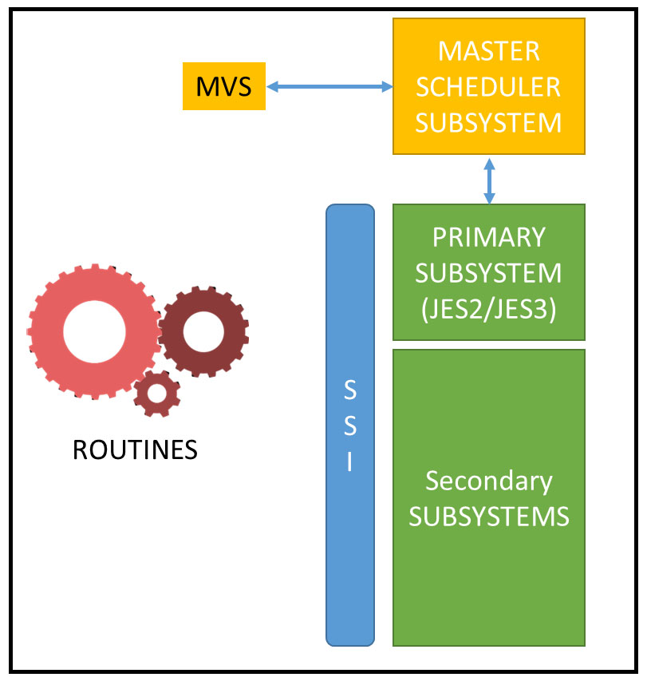

*図: PROGxx で APF / LNKLST / LPA を統合管理する流れ （出典: ABCs of z/OS Vol.02 (SG24-7977) p.35）*

#### 詳細手順

1. **現状確認**
   ```
   D PROG,APF,DSNAME=<dsn>
   ```
   または全 APF リスト:
   ```
   D PROG,APF
   ```

2. **PROGxx 編集**
   SYS1.PARMLIB(PROGxx) に以下を追加:
   ```
   APF ADD
       DSNAME(MY.NEW.LOADLIB)
       VOLUME(USRVOL)
   ```
   SMS-managed なら VOLUME 不要、SMS と書く:
   ```
   APF ADD
       DSNAME(MY.NEW.LOADLIB)
       SMS
   ```

3. **動的反映**
   ```
   SET PROG=xx
   ```

4. **確認**
   ```
   D PROG,APF,DSNAME=MY.NEW.LOADLIB
   ```
   STATE=A（active）と表示されれば成功。


#### 期待出力

```
IEE252I ... STATE=A
```

#### 検証

D PROG,APF,DSNAME=<dsn> で STATE=A。対象 APF 認可プログラムを実行してテスト。

#### バリエーション

SETPROG APF,ADD,DSNAME=...,VOLUME=... コマンドで一回限りの動的追加も可（次回 IPL で消える）。

#### 注意点

APF 認可は重大なセキュリティ影響あり。RACF FACILITY クラスで制御推奨。

#### 関連ユースケース

[uc-parmlib-iea-symdef](#uc-parmlib-iea-symdef), [uc-racf-fac-class](#uc-racf-fac-class)

**出典**: S_ZOS_Init_Tuning

---

### IEFSSN にサブシステム追加 { #uc-parmlib-iefssn }

**ID**: `uc-parmlib-iefssn` / **カテゴリ**: PARMLIB

#### 想定状況

新しいサブシステム（例: ICSF, RRS）を IPL 時に起動させたい。

#### 前提条件

- PARMLIB 編集権限
- 計画 IPL 時間


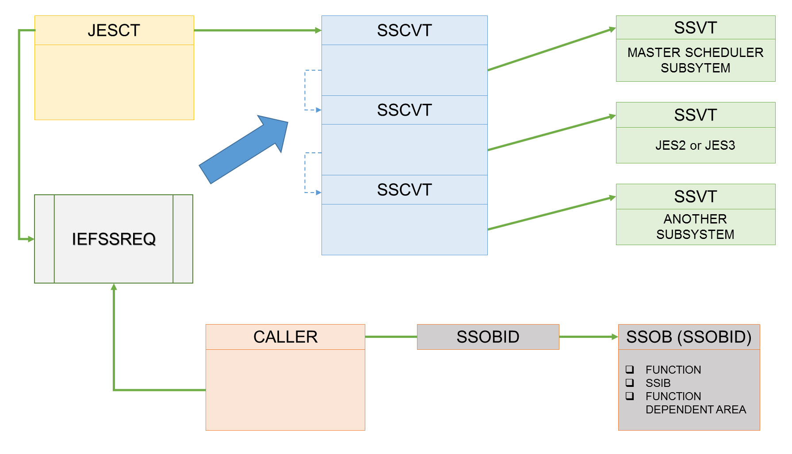

*図: SSI（JESCT→SSCVT→SSVT）のサブシステム呼び出し構造（IEFSSN 定義との対応） （出典: ABCs of z/OS Vol.02 (SG24-7977) p.37）*

#### 詳細手順

1. **既存サブシステム一覧確認**
   ```
   D SSI,ALL
   ```

2. **IEFSSNxx 編集**
   SYS1.PARMLIB(IEFSSNxx) に追加:
   ```
   SUBSYS SUBNAME(RRS)
          INITRTN(ATRIIRSI)
          INITPARM('GNAME=RRSGRP1,CTMEM=ATRRRS00')
   ```

3. **次回 IPL で反映**（多くのサブシステムは IPL 必要）
   一部は SETSSI ADD で動的追加可能:
   ```
   SETSSI ADD,SUBNAME=RRS
   ```

4. **確認**
   ```
   D SSI,ALL
   ```
   または:
   ```
   D A,L
   ```


#### 検証

D SSI,ALL に新サブシステム表示。D A,L で関連 STC active。

#### バリエーション

PRIMARY サブシステム（通常 JES2）は最初。順序は重要。SUBNAME に DEFAULT(YES) 指定で default 設定。

#### 注意点

順序を間違うと IPL 失敗の典型原因。事前に MASTERSCHEDULER 関連メンバとの整合確認必須。

#### 関連ユースケース

[uc-parmlib-progxx-apf](#uc-parmlib-progxx-apf), [uc-stc-autostart](#uc-stc-autostart)

**出典**: S_ZOS_Init_Tuning

---

### BPXPRMxx に zFS MOUNT を追加 { #uc-parmlib-bpx-mount }

**ID**: `uc-parmlib-bpx-mount` / **カテゴリ**: PARMLIB

#### 想定状況

新規 zFS aggregate を IPL 時に自動マウントさせたい。

#### 前提条件

- BPXPRMxx 編集権限
- zFS データセット作成済


*図: USS の zFS / HFS の MOUNT 構造（BPXPRMxx の MOUNT ステートメントと対応） （出典: ABCs of z/OS Vol.09 (SG24-7984) p.239）*

#### 詳細手順

1. **zFS aggregate 作成**（事前作業）
   ```
   //DEFZFS  EXEC PGM=IDCAMS
   //SYSPRINT DD SYSOUT=*
   //SYSIN DD *
     DEFINE CLUSTER(NAME(OMVS.NEW.ZFS) -
            VOLUMES(USRVOL) -
            LINEAR -
            MEGABYTES(500 100) -
            SHAREOPTIONS(3))
   ```

2. **zFS フォーマット**
   ```
   //FMTZFS  EXEC PGM=IOEAGFMT,
   //        PARM='-aggregate OMVS.NEW.ZFS -compat'
   ```

3. **BPXPRMxx に MOUNT 追加**
   ```
   MOUNT FILESYSTEM('OMVS.NEW.ZFS')
         TYPE(ZFS)
         MODE(RDWR)
         MOUNTPOINT('/u/newdata')
         AUTOMOVE
   ```

4. **動的マウント**（IPL 待ちなく即時反映）
   ```
   SETOMVS FILESYS=xx
   ```
   または USS シェルから:
   ```
   /usr/sbin/mount -t ZFS -f OMVS.NEW.ZFS /u/newdata
   ```

5. **確認**
   USS で:
   ```
   df -k
   ```


#### 検証

df -k 出力に新マウント表示。touch でファイル作成テスト。

#### バリエーション

AUTOMOVE で Sysplex 内自動移動。NOAUTOMOVE で固定。MODE(READ) で読取専用。

#### 注意点

MOUNTPOINT のディレクトリは事前 mkdir 必要。SHAREOPTIONS(3) は zFS 標準。

#### 関連ユースケース

[uc-uss-zfs-grow](#uc-uss-zfs-grow), [uc-parmlib-iefssn](#uc-parmlib-iefssn)

**出典**: S_ZOS_USS

---

### SMFPRMxx に新規 SMF type 追加 { #uc-parmlib-smfprm-add-type }

**ID**: `uc-parmlib-smfprm-add-type` / **カテゴリ**: PARMLIB

#### 想定状況

WLM 統計（SMF 99）や Db2 統計を新たに記録したい。

#### 前提条件

- SMFPRMxx 編集権限


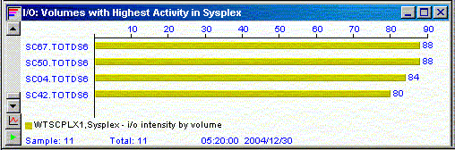

*図: SMF レコード収集の概念（SMFPRMxx の TYPE 設定との関係） （出典: ABCs of z/OS Vol.08 (SG24-7983) p.265）*

#### 詳細手順

1. **現状確認**
   ```
   D SMF
   ```
   現在の TYPE、データセット、active subsystem 表示。

2. **SMFPRMxx 編集**
   現状:
   ```
   SUBSYS(STC,EXITS(IEFU29,IEFU83),TYPE(0:255))
   SYS(NOTYPE(2:5,7,8,...),EXITS(...),NOINTERVAL,DETAIL)
   ```
   変更（特定 TYPE 追加）:
   ```
   SYS(TYPE(0,30,42,70:79,80,89,99,120),EXITS(...),NOINTERVAL,DETAIL)
   ```

3. **動的反映**
   ```
   SET SMF=xx
   ```

4. **確認**
   ```
   D SMF,O
   ```


#### 検証

D SMF,O で新 TYPE 一覧表示。IFASMFDP で抽出して新レコード確認。

#### バリエーション

TYPE 指定方法: TYPE(範囲) / NOTYPE(除外) / EXITS(IEFU29 等出口指定)。

#### 注意点

TYPE 30 = ジョブ, 70-79 = RMF, 80 = RACF, 89 = USS, 99 = WLM。SUBSYS 別に TYPE 個別設定可。

#### 関連ユースケース

[uc-smf-switch-dump](#uc-smf-switch-dump), [uc-parmlib-iea-symdef](#uc-parmlib-iea-symdef)

**出典**: S_ZOS_SMF

---

### Started Task の IPL 時自動起動 { #uc-stc-autostart }

**ID**: `uc-stc-autostart` / **カテゴリ**: PARMLIB

#### 想定状況

新規 STC を IPL 時に自動起動させたい。

#### 前提条件

- PARMLIB 編集権限
- PROCLIB に PROC 配置済


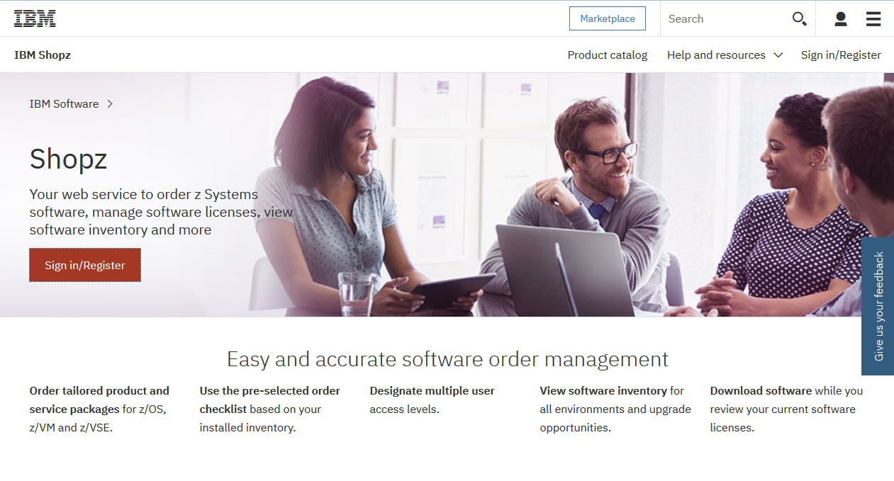

*図: z/OS の起動シーケンス（IPL → NIP → MVS startup）と STC 自動起動の位置 （出典: ABCs of z/OS Vol.01 (SG24-7976) p.37）*

#### 詳細手順

1. **既存 COMMNDxx 確認**
   ```
   D IPLINFO
   ```
   IPL 時に使用された COMMNDxx を表示。

2. **COMMNDxx 編集**
   SYS1.PARMLIB(COMMND00) 等に追加:
   ```
   COM='S MYAPP'
   COM='S TCPIP'
   COM='S RACFLOG'
   ```

3. **次回 IPL で自動実行**
   または現在のセッションで:
   ```
   S MYAPP
   ```

4. **確認**
   ```
   D A,L | grep MYAPP
   ```


#### 検証

次回 IPL 後 D A,L に対象 STC 表示。

#### バリエーション

AUTOLOG（TCPIP 専用）/ Automation Software（NetView, TSA）でも自動化可能。

#### 注意点

順序が重要なサブシステム（RACF → JES2 → 業務 STC）は MASTERSCHEDULER との連動も考慮。

#### 関連ユースケース

[uc-parmlib-iefssn](#uc-parmlib-iefssn)

**出典**: S_ZOS_Init_Tuning

---

## JES2

### JES2 SPOOL volume を動的追加 { #uc-jes2-spool-add }

**ID**: `uc-jes2-spool-add` / **カテゴリ**: JES2

#### 想定状況

JES2 SPOOL 使用率が 80% を超え、新規 volume を追加して容量拡張したい。

#### 前提条件

- MASTER コンソール権限
- 新規 volume 確保（DASD）


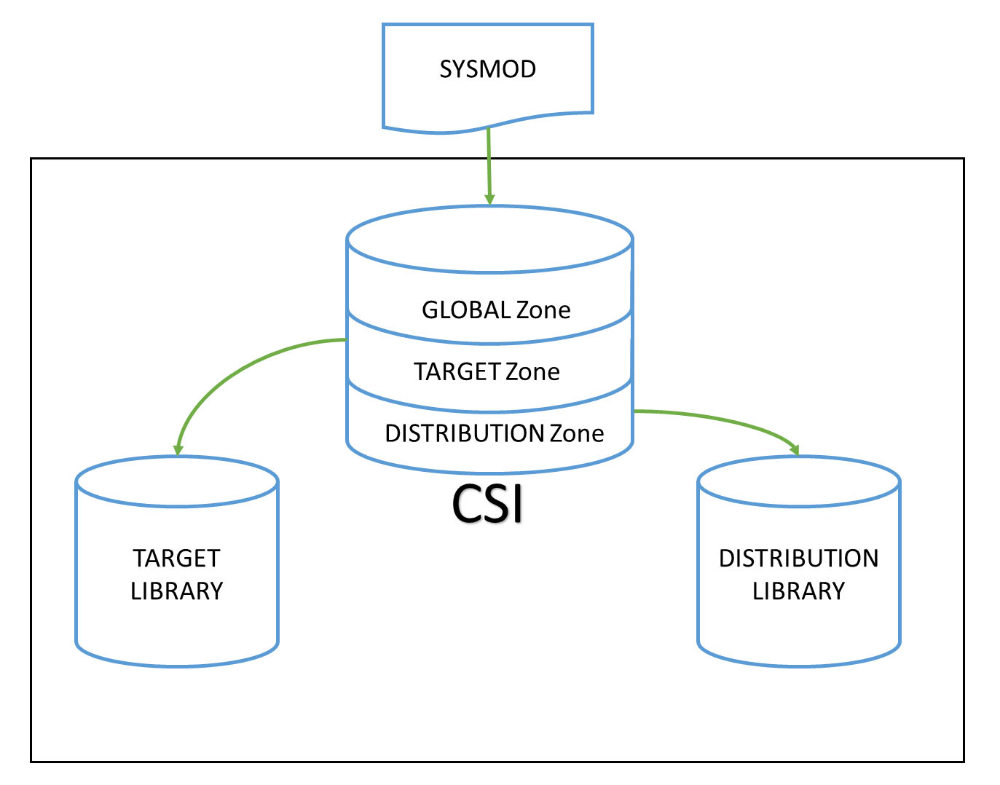

*図: JES2 SPOOL volume と CHKPT の関係 （出典: ABCs of z/OS Vol.02 (SG24-7977) p.162）*

#### 詳細手順

1. **現状確認**
   ```
   $D SPL
   $D Q
   ```

2. **新 SPOOL データセット事前作成**（JES2 起動前に IDCAMS で）
   ```
   //DEFSPL  EXEC PGM=IDCAMS
   //SYSIN DD *
     DEFINE CLUSTER(NAME(SYS1.HASPACE3) -
            VOL(SPOOL3) -
            CYL(2000 100) -
            SHR(2 3))
   ```

3. **JES2 に動的追加**
   ```
   $T SPOOL(SPOOL3),START
   ```
   または cold start で INITDECK の SPOOLDEF に追加。

4. **確認**
   ```
   $D SPL
   ```


#### 検証

$D SPL に新 SPOOL3 volume が STATUS=ACTIVE 表示。$D Q で容量増加確認。

#### バリエーション

$T SPOOL(...),DRAIN で抜き取り（メンテ時）。$T SPOOL(...),START で再開。

#### 注意点

SPOOL volume の SHAREOPTIONS は (2,3) が標準。同一 Sysplex 内のみ共有。

#### 関連ユースケース

[uc-sdsf-jes2-purge](#uc-sdsf-jes2-purge), [inc-jes2-spool-full](09-incident-procedures.md#inc-jes2-spool-full)

**出典**: S_ZOS_JES2

---

### JES2 イニシエータの CLASS 変更 { #uc-jes2-init-class-change }

**ID**: `uc-jes2-init-class-change` / **カテゴリ**: JES2

#### 想定状況

業務時間帯に応じてバッチ処理用イニシエータの受け持ち CLASS を変更したい。

#### 前提条件

- MASTER コンソール権限


*図: JES2 INITDECK の参照順序（HASPPARM → INITDECK） （出典: ABCs of z/OS Vol.02 (SG24-7977) p.35）*

#### 詳細手順

1. **現状確認**
   ```
   $DI
   ```
   各イニシエータの CLASS を表示。

2. **CLASS 変更**
   ```
   $T A1,CLASS=AB
   ```
   イニシエータ 1 の受け持ちを CLASS A と B 両方に。

3. **対象イニシエータがアクティブなら一旦停止 → 再開**
   ```
   $P I1
   $S I1
   ```
   または変更が effective immediate にならない場合、停止 → 再起動が必要。

4. **確認**
   ```
   $DI
   $DA
   ```


#### 検証

$DI で CLASS=AB 表示、$DA で対象 CLASS のジョブを取り込み開始。

#### バリエーション

$T JOBCLASS(A),... でクラス側の属性変更。$ADD INIT で新規イニシエータ動的追加（cold start なし）。

#### 注意点

CLASS 受け持ち変更後、新ジョブから effective。実行中ジョブには影響なし。

#### 関連ユースケース

[uc-jes2-spool-add](#uc-jes2-spool-add), [inc-jes2-spool-full](09-incident-procedures.md#inc-jes2-spool-full)

**出典**: S_ZOS_JES2

---

### JES2 新規 JOBCLASS 定義 { #uc-jes2-jobclass-define }

**ID**: `uc-jes2-jobclass-define` / **カテゴリ**: JES2

#### 想定状況

特定業務専用ジョブクラス（高優先度・大きい region size）を新規追加したい。

#### 前提条件

- JES2 INITDECK 編集権限
- JES2 warm start 計画


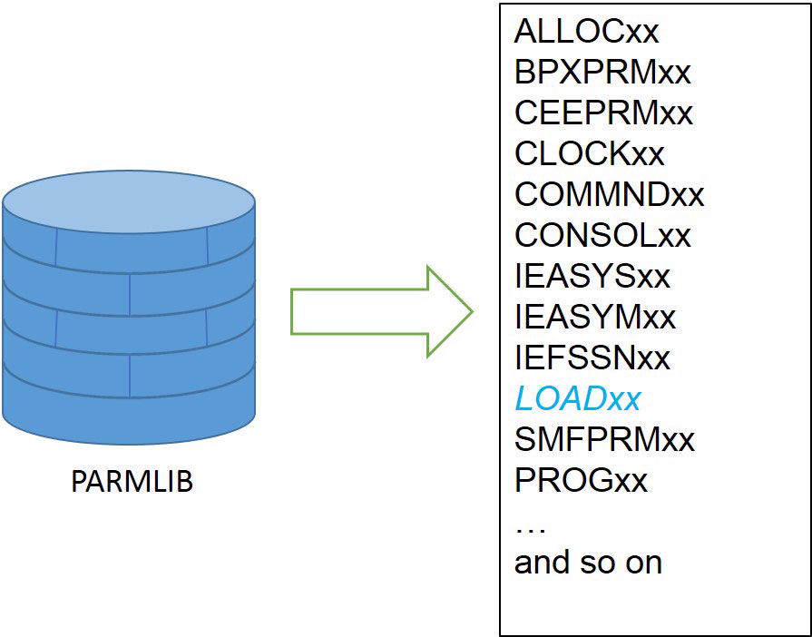

*図: JES2 のジョブ受付 → CLASS 振り分け → 実行の流れ （出典: ABCs of z/OS Vol.02 (SG24-7977) p.17）*

#### 詳細手順

1. **INITDECK 編集**
   ```
   JOBCLASS(P) PRIORITY=14
                MAXJOB=20
                REGION=512M
                AUTH=NORMAL
                BLP=NO
                SCHENV=PROD
   ```

2. **JES2 warm start**
   ```
   $P JES2
   S JES2,PARM='WARM,NOREQ'
   ```
   （または動的追加可能なら $T JOBCLASS(P),...）

3. **確認**
   ```
   $D JOBCLASS(P)
   ```

4. **テストジョブ投入**
   ```jcl
   //TEST JOB ...,CLASS=P
   ```


#### 検証

$D JOBCLASS(P) で定義表示。CLASS=P で submit したジョブが実行。

#### バリエーション

$ADD JOBCLASS で動的追加（cold start なし、JES2 v2.5+）。

#### 注意点

PRIORITY 1-15 の整数。SCHENV で WLM Scheduling Environment を指定すると Sysplex 内特定システムで実行。

#### 関連ユースケース

[uc-jes2-init-class-change](#uc-jes2-init-class-change), [uc-wlm-schenv-define](#uc-wlm-schenv-define)

**出典**: S_ZOS_JES2

---

### JES2 NJE で別システムへジョブ転送 { #uc-jes2-nje-route }

**ID**: `uc-jes2-nje-route` / **カテゴリ**: JES2

#### 想定状況

本番系で実行すべきジョブを開発系から /*ROUTE で投入したい。

#### 前提条件

- NJE 設定済（NETSRV/NODE/LINE 定義）
- 対向ノード稼働


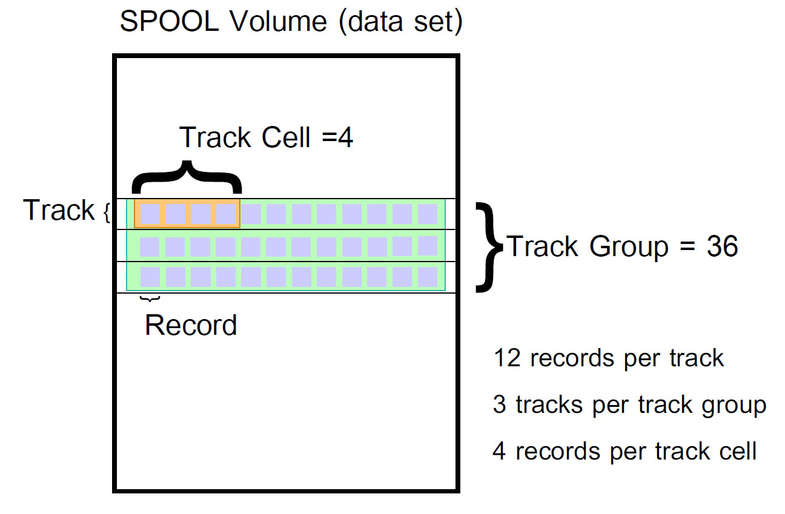

*図: JES2 NJE のノード間 SYSOUT/JCL 配信 （出典: ABCs of z/OS Vol.02 (SG24-7977) p.52）*

#### 詳細手順

1. **NJE 構成確認**
   ```
   $D NODE
   $D NETSRV
   $D LINE
   ```

2. **JCL に /*ROUTE 追加**
   ```jcl
   //PRODJOB JOB ...,CLASS=A
   /*ROUTE XEQ NODE_PROD
   //STEP1   EXEC ...
   ```
   または出力転送:
   ```
   /*ROUTE PRINT NODE_PROD.PRT01
   ```

3. **submit と確認**
   ```
   SUB 'USER01.JCL(PRODJOB)'
   ```
   応答に転送先表示。

4. **転送先で確認**
   PROD ノード側の SDSF ST で対象ジョブ受信確認。


#### 検証

対向ノードの SDSF ST にジョブ表示、転送先で実行されている。

#### バリエーション

/*XEQ <node> でも同じ。/*JOBPARM SYSAFF=<sysname> は同一 Sysplex 内 JES2 メンバ間（NJE と異なる）。

#### 注意点

NJE は LINE/PATH 設定済みであることが前提。トラブル時は $D LINE / $D PATH で診断。

#### 関連ユースケース

[uc-jes2-init-class-change](#uc-jes2-init-class-change)

**出典**: S_ZOS_JES2

---

## SMF

### SMF データセット SWITCH と DUMP { #uc-smf-switch-dump }

**ID**: `uc-smf-switch-dump` / **カテゴリ**: SMF

#### 想定状況

SMF データセット（SYS1.MAN1）が満杯近、次のデータセットへ切り替えて旧データを history に保存したい。

#### 前提条件

- SMF 操作権限
- DUMP 先データセット容量確保


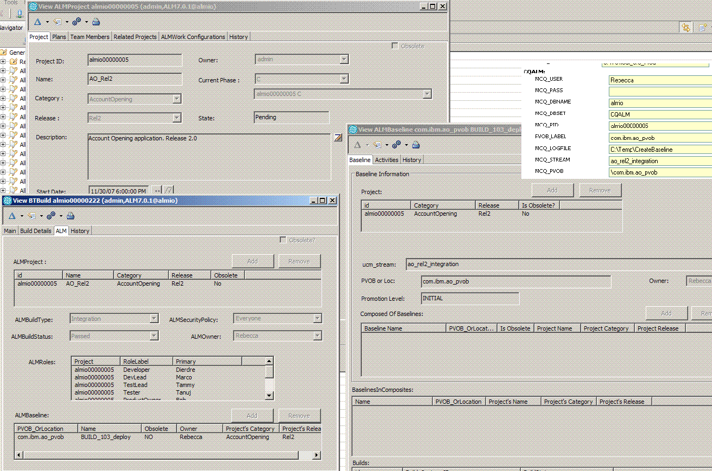

*図: SDSF SP（SPOOL volume）パネル — SMF dump 後の確認に有用 （出典: ABCs of z/OS Vol.13 (SG24-7988) p.394）*

#### 詳細手順

1. **現状確認**
   ```
   D SMF
   ```
   ACTIVE データセット、使用率（FULL ステータス）確認。

2. **SWITCH SMF コマンド**
   ```
   I SMF
   ```
   現 active データセットを inactive 化、次データセットへ切替。

3. **inactive データセットを DUMP**
   ```jcl
   //DUMPSMF EXEC PGM=IFASMFDP
   //DUMPIN  DD DSN=SYS1.MAN1,DISP=SHR
   //DUMPOUT DD DSN=SMF.HISTORY.D250504,DISP=(NEW,CATLG),
   //           UNIT=SYSDA,SPACE=(CYL,(100,50))
   //SYSIN DD *
     INDD(DUMPIN,OPTIONS(DUMP))
     OUTDD(DUMPOUT,TYPE(0:255))
   ```

4. **DUMP 完了後、データセットをクリア**
   IFASMFDP の DUMP 後、SYS1.MAN1 は自動的に空に。

5. **確認**
   ```
   D SMF
   ```


#### 検証

D SMF で active データセット切替、空き容量回復。SMF.HISTORY.D250504 にレコード保存。

#### バリエーション

SMF Logger 利用なら自動で SWITCH 不要。手動 DUMP は不要、IFASMFDP で抽出のみ。

#### 注意点

SMF データセットを LOGSTREAM に切り替えるとサイズ管理が不要になる。

#### 関連ユースケース

[uc-parmlib-smfprm-add-type](#uc-parmlib-smfprm-add-type), [inc-smf-collect-fail](09-incident-procedures.md#inc-smf-collect-fail)

**出典**: S_ZOS_SMF

---

### IFASMFDP で SMF Type 30 を抽出 { #uc-smf-extract-type30 }

**ID**: `uc-smf-extract-type30` / **カテゴリ**: SMF

#### 想定状況

前日のジョブ統計（CPU 時間、I/O 数等）を Type 30 から抽出してレポートに使いたい。

#### 前提条件

- SMF history データセット参照権限


*図: IFASMFDP による SMF Type 30 抽出の概念 （出典: ABCs of z/OS Vol.08 (SG24-7983) p.265）*

#### 詳細手順

1. **対象 history データセット確認**
   ```
   LISTC LEVEL(SMF.HISTORY) ALL
   ```

2. **IFASMFDP で Type 30 のみ抽出**
   ```jcl
   //EXTRACT EXEC PGM=IFASMFDP
   //DUMPIN  DD DSN=SMF.HISTORY.D250503,DISP=SHR
   //DUMPOUT DD DSN=USER01.SMF30.D250503,DISP=(NEW,CATLG),
   //           UNIT=SYSDA,SPACE=(CYL,(100,50))
   //SYSIN DD *
     INDD(DUMPIN,OPTIONS(DUMP))
     OUTDD(DUMPOUT,TYPE(30))
   ```

3. **抽出結果をレポートツールへ**
   - SAS / 自作 REXX / IBM RMF Postprocessor 等で集計

4. **確認**
   ```
   LISTC ENTRIES(USER01.SMF30.D250503)
   ```


#### 検証

出力データセットがアロケート済、レコード数が想定範囲内。

#### バリエーション

DATE/TIME 指定でさらに絞り込み: OPTIONS(DUMP),DATE(2026136,2026137),START(0900),END(1700)。

#### 注意点

SMF Type 30 は subtype 1-6 で内訳。Type 30 subtype 5 がジョブ終了レコード。

#### 関連ユースケース

[uc-smf-switch-dump](#uc-smf-switch-dump), [uc-parmlib-smfprm-add-type](#uc-parmlib-smfprm-add-type)

**出典**: S_ZOS_SMF

---

### SMF を Logger に切り替え { #uc-smf-logger-setup }

**ID**: `uc-smf-logger-setup` / **カテゴリ**: SMF

#### 想定状況

SYS1.MAN* 方式から System Logger 方式に切り替えてサイズ管理を自動化したい。

#### 前提条件

- LOGREC / Logger 設定済
- CFRM Policy で Logger structure 定義


*図: SDSF DA（active address space）パネル — SMF Logger STC の動作確認用 （出典: ABCs of z/OS Vol.13 (SG24-7988) p.49）*

#### 詳細手順

1. **Logger structure 確認**
   ```
   D LOGGER
   D XCF,STR
   ```

2. **SMFPRMxx を LOGSTREAM 方式に変更**
   旧:
   ```
   DSNAME(SYS1.MAN1,SYS1.MAN2,SYS1.MAN3)
   ```
   新:
   ```
   LSNAME(IFASMF.DEFAULT,TYPE(0:255))
   ```

3. **動的反映**
   ```
   SET SMF=xx
   ```

4. **Logger に書き込み開始確認**
   ```
   D SMF
   D LOGGER,L
   ```

5. **読み出しは IFASMFDL（Logger 用）で**
   ```jcl
   //EXTRACT EXEC PGM=IFASMFDL
   //OUTDD1  DD DSN=...,DISP=(NEW,CATLG),...
   //SYSIN DD *
     LSNAME(IFASMF.DEFAULT,OPTIONS(DUMP))
     OUTDD(OUTDD1,TYPE(30))
   ```


#### 検証

D SMF で LSNAME 表示、Logger に対し書き込み発生。IFASMFDL で抽出可能。

#### バリエーション

Sysplex 内全システムが同 Logger に書き込めば集中管理可能。

#### 注意点

Logger 方式は CDS / CFRM 設定が前提。SMF Logger structure のサイズ計画必須。

#### 関連ユースケース

[uc-smf-switch-dump](#uc-smf-switch-dump), [uc-sysplex-cfrm-update](#uc-sysplex-cfrm-update)

**出典**: S_ZOS_SMF

---

## RACF

### RACF データセット保護プロファイル新規作成 { #uc-racf-dataset-profile }

**ID**: `uc-racf-dataset-profile` / **カテゴリ**: RACF

#### 想定状況

新業務用データセット PROD.DATA.* を保護し、PROD グループのみアクセス可能にしたい。

#### 前提条件

- RACF SPECIAL or DATASET class authority


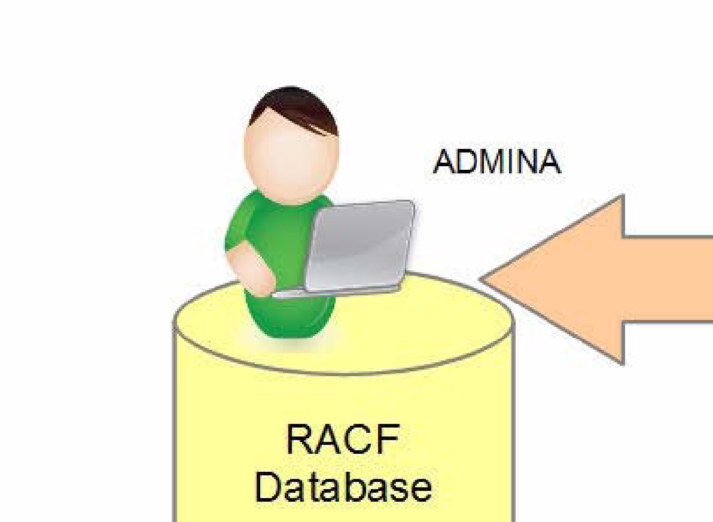

*図: RACF Database 管理者の権限委譲と SETROPTS （出典: ABCs of z/OS Vol.06 (SG24-7981) p.137）*

#### 詳細手順

1. **既存プロファイル確認**
   ```
   SEARCH CLASS(DATASET) MASK(PROD.DATA)
   ```

2. **GENERIC プロファイル作成**
   ```
   ADDSD 'PROD.DATA.*.**' UACC(NONE) GENERIC OWNER(SYSADM)
   ```

3. **PROD グループに権限付与**
   ```
   PERMIT 'PROD.DATA.*.**' CLASS(DATASET) ID(PRODGRP) ACCESS(UPDATE) GENERIC
   ```

4. **特定の管理者には ALTER**
   ```
   PERMIT 'PROD.DATA.*.**' CLASS(DATASET) ID(SYSADM) ACCESS(ALTER) GENERIC
   ```

5. **GENERIC REFRESH**
   ```
   SETROPTS GENERIC(DATASET) REFRESH
   ```

6. **確認**
   ```
   LISTDSD DA('PROD.DATA.*.**') GENERIC AUTHUSER
   ```


#### 検証

LISTDSD AUTHUSER でアクセスリスト表示。テストユーザでアクセス試行。

#### バリエーション

個別データセットのみは discrete profile（GENERIC なし）。WARNING モードで一時的にアクセス許容も可。

#### 注意点

GENERIC profile は patterns マッチで一括保護。SETR GENERIC REFRESH を忘れると新 profile が effective にならない。

#### 関連ユースケース

[uc-racf-fac-class](#uc-racf-fac-class), [uc-racf-permit-grp](#uc-racf-permit-grp)

**出典**: S_ZOS_RACF

---

### RACF FACILITY クラスでのリソース制御 { #uc-racf-fac-class }

**ID**: `uc-racf-fac-class` / **カテゴリ**: RACF

#### 想定状況

BPX.SUPERUSER などの FACILITY クラスリソースで USS root 権限を制御したい。

#### 前提条件

- RACF SPECIAL


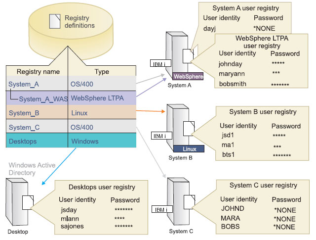

*図: RACF FACILITY クラス経由のリソース制御 （出典: ABCs of z/OS Vol.06 (SG24-7981) p.214）*

#### 詳細手順

1. **FACILITY クラス active 化**（既に active なら不要）
   ```
   SETROPTS CLASSACT(FACILITY)
   SETROPTS RACLIST(FACILITY)
   ```

2. **BPX.SUPERUSER profile 作成**
   ```
   RDEFINE FACILITY BPX.SUPERUSER UACC(NONE)
   ```

3. **特定ユーザに権限**
   ```
   PERMIT BPX.SUPERUSER CLASS(FACILITY) ID(USER01) ACCESS(READ)
   ```

4. **RACLIST REFRESH**
   ```
   SETROPTS RACLIST(FACILITY) REFRESH
   ```

5. **USS でテスト**
   ```sh
   $ su -
   # id
   uid=0(BPXROOT)
   ```


#### 検証

su - 後 uid=0、id コマンドで BPXROOT 表示。

#### バリエーション

BPX.DAEMON / BPX.SERVER も同様。BPX.JOBNAME で USS BPXAS のジョブ名動的変更可能。

#### 注意点

FACILITY クラスは RACLIST 必須。REFRESH を忘れると変更が反映されない。

#### 関連ユースケース

[uc-racf-dataset-profile](#uc-racf-dataset-profile), [uc-uss-zfs-grow](#uc-uss-zfs-grow)

**出典**: S_ZOS_RACF

---

### RACF グループメンバ追加とアクセス権継承 { #uc-racf-permit-grp }

**ID**: `uc-racf-permit-grp` / **カテゴリ**: RACF

#### 想定状況

新メンバを既存グループに追加して、グループ経由のリソース権限を継承させたい。

#### 前提条件

- 対象 GROUP の OWNERSHIP or class authority


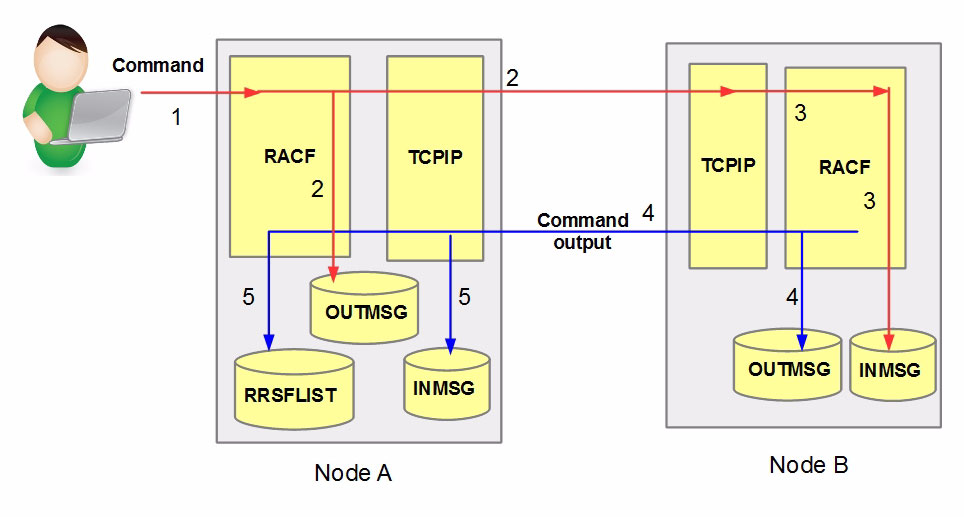

*図: RACF コマンドの Node A → Node B 配信（OUTMSG/INMSG/RRSFLIST 経由） （出典: ABCs of z/OS Vol.06 (SG24-7981) p.138）*

#### 詳細手順

1. **グループ存在確認**
   ```
   LG PRODGRP
   ```

2. **メンバ追加**
   ```
   CONNECT USER02 GROUP(PRODGRP) AUTHORITY(USE)
   ```

3. **確認**
   ```
   LU USER02
   LG PRODGRP
   ```

4. **対象リソースのアクセス確認**
   ```
   LISTDSD DA('PROD.DATA.*.**') GENERIC AUTHUSER
   ```
   PRODGRP がリストにあれば USER02 も継承する。

5. **テスト**
   USER02 でログオンして、READ または UPDATE 試行。


#### 検証

LU USER02 で GROUPS リストに PRODGRP。テストアクセス成功。

#### バリエーション

AUTHORITY(CREATE/CONNECT/JOIN) で管理権限付与。REVOKE/RESUME で一時無効化/再有効化。

#### 注意点

RACF GRPLIST option が active なら全グループの権限が effective、なければ default group のみ。

#### 関連ユースケース

[uc-racf-dataset-profile](#uc-racf-dataset-profile)

**出典**: S_ZOS_RACF

---

## TCPIP

### TCPIP PROFILE に HOME ステートメント追加 { #uc-tcpip-home-add }

**ID**: `uc-tcpip-home-add` / **カテゴリ**: TCPIP

#### 想定状況

新規 IP アドレスをホスト追加して特定 OSA から外部公開したい。

#### 前提条件

- PROFILE.TCPIP 編集権限


*図: z/OS TCP/IP Stack（PROFILE / Resolver / TCPIP STC）の構成 （出典: ABCs of z/OS Vol.04 (SG24-7979) p.67）*

#### 詳細手順

1. **現状確認**
   ```
   NETSTAT HOME
   ```

2. **PROFILE.TCPIP のバックアップ**
   既存 TCPIP プロファイルデータセットを ISPF EDIT でコピー。

3. **OBEY ファイル準備**（差分のみ反映するため）
   ```
   //OBEY EXEC PGM=IEFBR14
   ;
   ; 新規 HOME 追加
   ;
   HOME
     192.168.10.20  OSA01LINK
   ENDHOME
   ```

4. **動的反映**
   ```
   V TCPIP,,O,'USER01.TCPIP.OBEY(NEWHOME)'
   ```

5. **確認**
   ```
   NETSTAT HOME
   ping 192.168.10.20
   ```


#### 検証

NETSTAT HOME に新 IP 表示。外部から ping 成功。

#### バリエーション

VIPA（Virtual IP Address）使用なら HOME に VIPADYNAMIC 等で動的追加。

#### 注意点

OBEY は差分適用、PROFILE 全体反映は VARY TCPIP,,OBEYFILE,'<full profile>'。OBEY 後の状態を反映保存するには PROFILE.TCPIP を更新。

#### 関連ユースケース

[uc-tcpip-port-reserve](#uc-tcpip-port-reserve), [inc-tcpip-down](09-incident-procedures.md#inc-tcpip-down)

**出典**: S_ZOS_CommServer

---

### PORT 予約と AUTOLOG { #uc-tcpip-port-reserve }

**ID**: `uc-tcpip-port-reserve` / **カテゴリ**: TCPIP

#### 想定状況

業務サーバ用に固定 port を予約し、起動時自動で listening するように設定したい。

#### 前提条件

- PROFILE.TCPIP 編集権限


*図: PROFILE.TCPIP の PORT / RESERVE 定義の概念 （出典: ABCs of z/OS Vol.04 (SG24-7979) p.117）*

#### 詳細手順

1. **現状確認**
   ```
   NETSTAT PORTLIST
   ```

2. **PROFILE.TCPIP に PORT 追加**
   ```
   PORT
     8080 TCP MYAPP NOAUTOLOG
     8443 TCP MYAPP NOAUTOLOG SAF MYAPP.PORT
   ENDPORT
   ```

3. **AUTOLOG セクションに STC 追加**
   ```
   AUTOLOG
     MYAPP JOBNAME MYAPP
   ENDAUTOLOG
   ```

4. **OBEY で動的反映**
   ```
   V TCPIP,,O,'USER01.TCPIP.OBEY(PORTNEW)'
   ```

5. **MYAPP STC 起動**
   ```
   S MYAPP
   ```

6. **確認**
   ```
   NETSTAT PORTLIST
   D A,L | grep MYAPP
   ```


#### 検証

NETSTAT PORTLIST に reserve 表示、MYAPP STC が起動して port を listening。

#### バリエーション

SAF プロテクション付きで RACF SERVAUTH クラスと連携。NOAUTOLOG だと自動起動なし。

#### 注意点

PORT 予約は port hijack 防止。SAF 指定で port 利用権限を RACF で制御。

#### 関連ユースケース

[uc-tcpip-home-add](#uc-tcpip-home-add), [uc-stc-autostart](#uc-stc-autostart)

**出典**: S_ZOS_CommServer

---

## SDSF

### SDSF からジョブ大量パージ { #uc-sdsf-jes2-purge }

**ID**: `uc-sdsf-jes2-purge` / **カテゴリ**: SDSF

#### 想定状況

JES2 SPOOL が満杯近、SDSF ST で完了済ジョブを一括 PURGE したい。

#### 前提条件

- SDSF アクセス権
- JES2 操作権限（RACF SDSF.* 等）


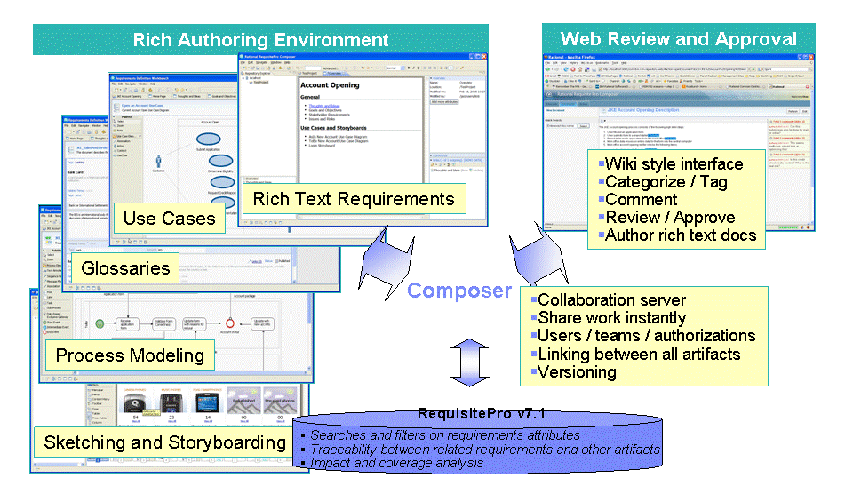

*図: SDSF ST パネルでのジョブ操作（C/P/S 等） （出典: ABCs of z/OS Vol.13 (SG24-7988) p.138）*

#### 詳細手順

1. **SDSF 起動して ST パネル**
   ```
   ==> ST
   ```

2. **フィルタ設定**
   ```
   ==> PRE *
   ==> OWNER USER01
   ==> ST OUTPUT
   ```
   OWNER, PREFIX, STATUS で対象絞り込み。

3. **複数ジョブ選択して P コマンド**
   各ジョブ行の NP カラムに P 入力（または ALL P）:
   ```
   NP   JOBNAME  ...
   P    JOB001  ...
   P    JOB002  ...
   ```

4. **Enter で実行確認**
   ```
   $HASP890 JOB(JOB001) PURGED
   ```

5. **SPOOL 使用率確認**
   ```
   ==> /$D Q
   ```


#### 検証

SDSF ST から対象ジョブ消滅、$D Q で SPOOL 使用率低下。

#### バリエーション

SDSF DA で実行中ジョブの取消（C コマンド）も同様。

#### 注意点

PURGE 後は復元不可。重要ジョブは事前に SAVE/PRINT で出力保存。

#### 関連ユースケース

[uc-jes2-spool-add](#uc-jes2-spool-add), [inc-jes2-spool-full](09-incident-procedures.md#inc-jes2-spool-full)

**出典**: S_ZOS_SDSF

---

### SDSF SYSLOG/OPERLOG で問題調査 { #uc-sdsf-syslog-search }

**ID**: `uc-sdsf-syslog-search` / **カテゴリ**: SDSF

#### 想定状況

ジョブ実行中に発生した問題のメッセージを SYSLOG から検索したい。

#### 前提条件

- SDSF アクセス、LOG 権限


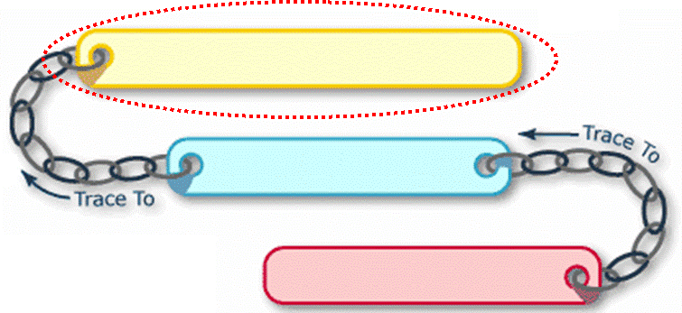

*図: SDSF LOG（OPERLOG / SYSLOG）パネル （出典: ABCs of z/OS Vol.13 (SG24-7988) p.121）*


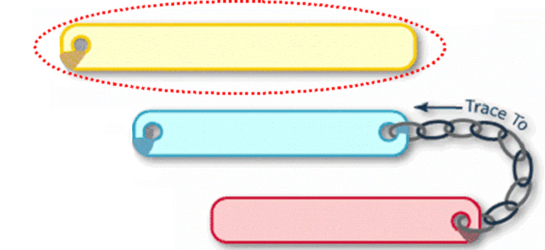

*図: SDSF LOG での FIND / FILTER による検索 （出典: ABCs of z/OS Vol.13 (SG24-7988) p.122）*

#### 詳細手順

1. **SDSF LOG パネル**
   ```
   ==> LOG
   ```
   または OPERLOG:
   ```
   ==> LOG O
   ```

2. **時刻範囲指定**
   ```
   ==> TIME 09:00 11:00
   ```

3. **キーワード検索**
   ```
   ==> FIND IEC502E
   ```
   または:
   ```
   ==> FIND JOB12345
   ```

4. **前後コンテキスト確認**
   F8/F7 で前後ページ移動。

5. **必要なら抽出**
   PRINT コマンドで該当範囲を SYSOUT に出力。


#### 検証

対象メッセージが見つかる。前後の関連メッセージで原因把握。

#### バリエーション

OPERLOG は Sysplex 全体（Logger 経由）、SYSLOG は単一システム。

#### 注意点

OPERLOG が利用可能なら Sysplex 全体ログ調査が容易。

#### 関連ユースケース

[uc-sdsf-jes2-purge](#uc-sdsf-jes2-purge), [inc-syslog-investigation](09-incident-procedures.md#inc-syslog-investigation)

**出典**: S_ZOS_SDSF

---

### オペレータコマンドで DASD 切り離し { #uc-oper-vary-device }

**ID**: `uc-oper-vary-device` / **カテゴリ**: SDSF

#### 想定状況

DASD メンテナンスのため特定 volume をオフライン化したい。

#### 前提条件

- MASTER コンソール権限


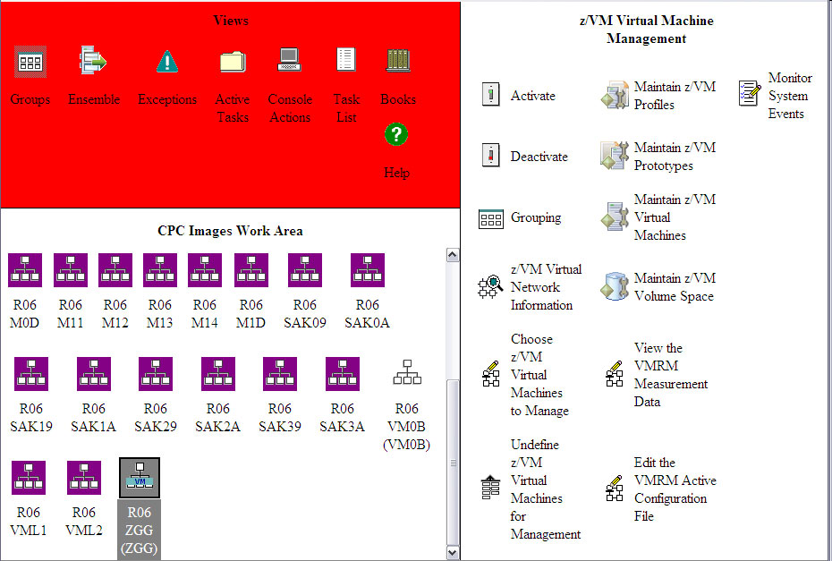

*図: HCD で IODF を生成 → IPL 時に読み込み（VARY device 操作の前提） （出典: ABCs of z/OS Vol.10 (SG24-7985) p.140）*

#### 詳細手順

1. **対象 volume 上のデータセット使用確認**
   ```
   D U,,,8001,1
   D GRS,DEV=8001
   ```

2. **使用中なら関連ジョブ停止 / 待機**

3. **オフライン化**
   ```
   V 8001,OFFLINE
   ```
   応答:
   ```
   IEE302I 8001 OFFLINE
   ```

4. **メンテ実施**

5. **オンライン復旧**
   ```
   V 8001,ONLINE
   ```

6. **確認**
   ```
   D U,,,8001,1
   ```


#### 検証

D U,,,8001,1 で STATUS=O（online）または F（offline）。

#### バリエーション

複数 device 一括: V 8000-8003,OFFLINE。VARY PATH で path 単位制御も。

#### 注意点

オフライン中はそのデバイス上のデータセットアクセス不可。マウント中ジョブに影響。

#### 関連ユースケース

[uc-sdsf-jes2-purge](#uc-sdsf-jes2-purge)

**出典**: S_ZOS_MVS_Cmds

---

## USS

### zFS aggregate を動的拡張 { #uc-uss-zfs-grow }

**ID**: `uc-uss-zfs-grow` / **カテゴリ**: USS

#### 想定状況

USS マウント済 zFS が満杯近、unmount せず拡張したい。

#### 前提条件

- zFS 管理権限
- BPXPRMxx 編集権限（事後反映）


*図: zfsadm grow による zFS aggregate 拡張 （出典: ABCs of z/OS Vol.09 (SG24-7984) p.703）*

#### 詳細手順

1. **現状確認**
   USS で:
   ```sh
   df -k /u/data
   /usr/sbin/zfsadm aggrinfo OMVS.DATA.ZFS -long
   ```

2. **拡張**
   オプション 1: 既存データセット拡張（メガバイト指定）
   ```sh
   /usr/sbin/zfsadm grow -aggregate OMVS.DATA.ZFS -size 1024
   ```
   オプション 2: 新規 candidate volume 追加
   ```jcl
   //ALTER  EXEC PGM=IDCAMS
   //SYSIN DD *
     ALTER OMVS.DATA.ZFS ADDVOLUMES(USRVOL2)
   ```
   その後:
   ```sh
   /usr/sbin/zfsadm grow -aggregate OMVS.DATA.ZFS
   ```

3. **df で確認**
   ```sh
   df -k /u/data
   ```


#### 検証

df -k で容量増加。touch で書き込みテスト。

#### バリエーション

zfsadm shrink で縮小も可能（一定条件下）。

#### 注意点

拡張中もマウント維持、業務影響なし。Sysplex で sysplex-aware zFS なら他システムへの影響も無し。

#### 関連ユースケース

[uc-parmlib-bpx-mount](#uc-parmlib-bpx-mount), [inc-uss-fs-full](09-incident-procedures.md#inc-uss-fs-full)

**出典**: S_ZOS_USS

---

### RACF OMVS セグメント追加 { #uc-uss-omvs-segment }

**ID**: `uc-uss-omvs-segment` / **カテゴリ**: USS

#### 想定状況

新規 TSO ユーザを USS でも使えるように OMVS セグメント追加したい。

#### 前提条件

- RACF USER class authority


*図: USS の OMVS segment（UID/GID/HOME）と zFS の関係 （出典: ABCs of z/OS Vol.09 (SG24-7984) p.315）*

#### 詳細手順

1. **OMVS セグメント追加**
   ```
   ALTUSER USER01 OMVS(UID(500) HOME('/u/user01') PROGRAM('/bin/sh'))
   ```

2. **HOME directory 作成**
   USS で（root 権限で）:
   ```sh
   $ su -
   # mkdir /u/user01
   # chown user01:STAFF /u/user01
   # chmod 755 /u/user01
   ```

3. **確認**
   ```
   LU USER01 OMVS
   ```
   表示:
   ```
   OMVS INFORMATION
   ----------------
   UID= 0000000500
   HOME= /u/user01
   PROGRAM= /bin/sh
   ```

4. **USS でテスト**
   ```
   TSO> OMVS
   $ id
   uid=500(USER01) gid=10(STAFF) ...
   ```


#### 検証

LU OMVS で属性表示、OMVS シェル起動成功。

#### バリエーション

GROUP にも OMVS GID 追加: ALTGROUP STAFF OMVS(GID(10))。AUTOUID/AUTOGID で自動採番。

#### 注意点

UID 0 は BPXROOT 専用。一般ユーザは 100+ を慣例。

#### 関連ユースケース

[uc-racf-fac-class](#uc-racf-fac-class), [uc-uss-zfs-grow](#uc-uss-zfs-grow)

**出典**: S_ZOS_USS

---

### BPXBATCH で USS シェルスクリプト実行 { #uc-uss-bpxbatch }

**ID**: `uc-uss-bpxbatch` / **カテゴリ**: USS

#### 想定状況

夜間バッチで USS シェルスクリプトを実行して結果を SYSOUT に出力したい。

#### 前提条件

- BPXBATCH 利用可能
- 対象シェルスクリプト配置済


*図: BPXBATCH による USS シェルスクリプト → JES2 バッチ実行 （出典: ABCs of z/OS Vol.09 (SG24-7984) p.632）*

#### 詳細手順

1. **シェルスクリプト準備**
   USS で /u/user01/scripts/nightly.sh:
   ```sh
   #!/bin/sh
   echo "Job started: $(date)"
   /u/user01/bin/myapp --batch
   echo "Job ended: $(date)"
   ```
   実行権限:
   ```sh
   chmod 755 /u/user01/scripts/nightly.sh
   ```

2. **JCL 準備**
   ```jcl
   //NIGHTLY  JOB ...,CLASS=A
   //STEP1    EXEC PGM=BPXBATCH,
   //         PARM='SH /u/user01/scripts/nightly.sh'
   //STDOUT   DD SYSOUT=*
   //STDERR   DD SYSOUT=*
   ```

3. **submit**
   ```
   SUB 'USER01.JCL(NIGHTLY)'
   ```

4. **SDSF ST で結果確認**
   STDOUT で標準出力、STDERR で標準エラー。


#### 検証

ジョブ RC=0、STDOUT に期待出力。STDERR にエラー無し。

#### バリエーション

PARM='PGM /u/user01/bin/binary' で実行ファイル直接呼び出し。STDIN DD で入力供給。

#### 注意点

BPXBATCH 内部で BPXAS（/usr/sbin/sh）が動作。シェルスクリプトの shebang #!/bin/sh は必須。

#### 関連ユースケース

[uc-uss-omvs-segment](#uc-uss-omvs-segment), [inc-uss-batch](09-incident-procedures.md#inc-uss-batch)

**出典**: S_ZOS_USS

---

## DFSMS

### IDCAMS で VSAM KSDS 作成 { #uc-vsam-define }

**ID**: `uc-vsam-define` / **カテゴリ**: DFSMS

#### 想定状況

新規業務用 VSAM KSDS を作成し、初期データを REPRO で投入したい。

#### 前提条件

- Catalog UPDATE 権限
- Volume 容量確保


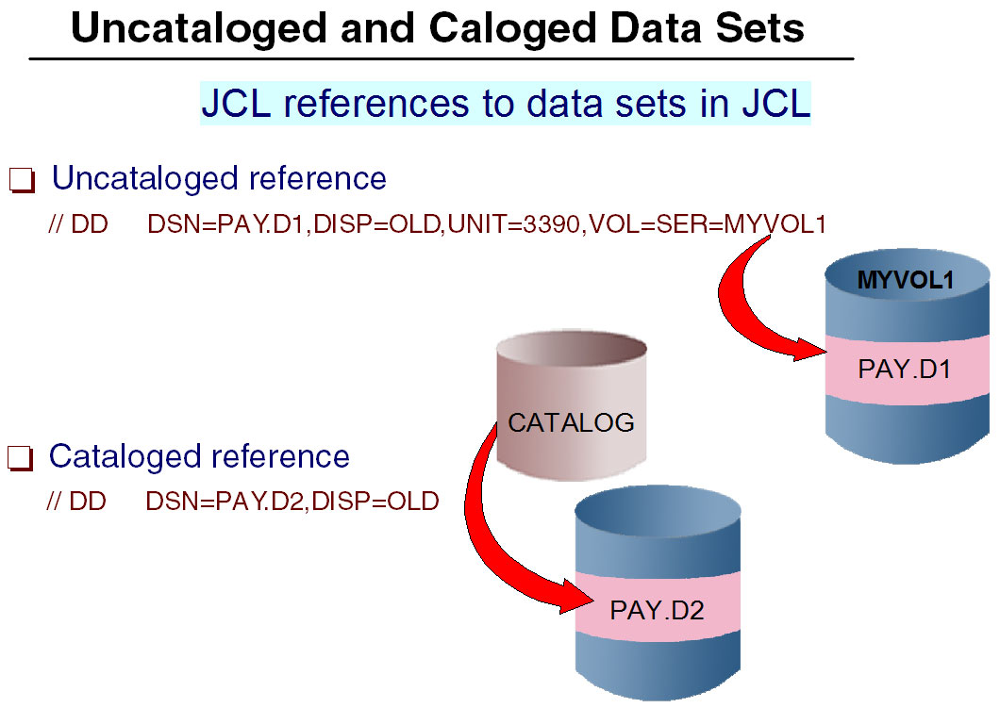

*図: JCL の Cataloged 参照（DSN のみ）と Uncataloged 参照（DSN+VOLSER） （出典: ABCs of z/OS Vol.03 (SG24-7978) p.36）*


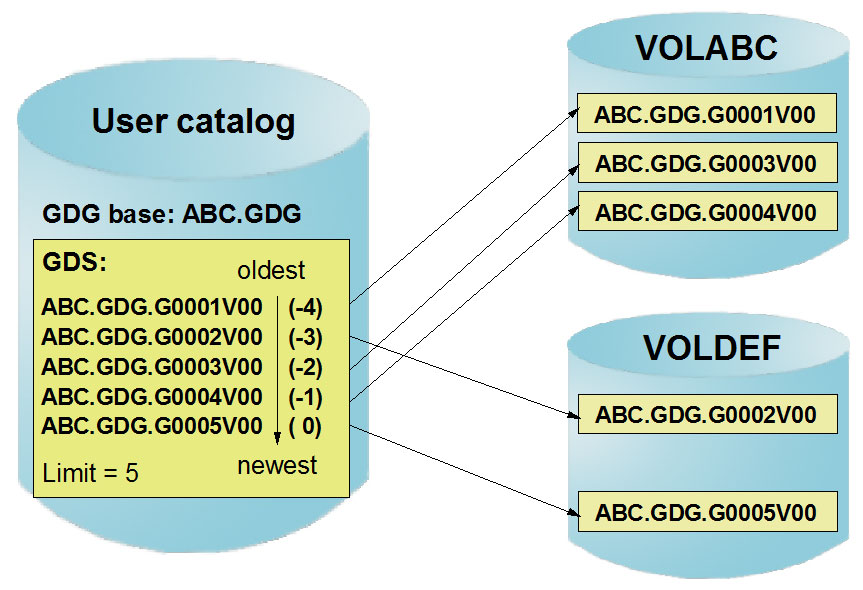

*図: VSAM Cluster（KSDS/ESDS/RRDS/LDS）の構造概念 （出典: ABCs of z/OS Vol.03 (SG24-7978) p.63）*

#### 詳細手順

1. **DEFINE CLUSTER**
   ```jcl
   //DEFINE EXEC PGM=IDCAMS
   //SYSPRINT DD SYSOUT=*
   //SYSIN DD *
     DEFINE CLUSTER( -
       NAME(USER01.MYDATA.KSDS) -
       VOLUMES(USRVOL) -
       CYLINDERS(50 10) -
       INDEXED -
       KEYS(10 0) -
       RECORDSIZE(100 200) -
       SHAREOPTIONS(2 3) -
     ) -
     DATA(NAME(USER01.MYDATA.KSDS.DATA)) -
     INDEX(NAME(USER01.MYDATA.KSDS.INDEX))
   ```

2. **REPRO で初期データ投入**
   ```jcl
   //REPRO  EXEC PGM=IDCAMS
   //INDD   DD DSN=USER01.SEQ.INPUT,DISP=SHR
   //OUTDD  DD DSN=USER01.MYDATA.KSDS,DISP=SHR
   //SYSIN DD *
     REPRO INFILE(INDD) OUTFILE(OUTDD)
   ```

3. **LISTC で確認**
   ```
   LISTC ENTRIES('USER01.MYDATA.KSDS') ALL
   ```


#### 検証

LISTC で構造表示、レコード数表示。アプリから OPEN/READ テスト。

#### バリエーション

ESDS（順次）/ RRDS（相対レコード）/ LDS（線形）も同様 DEFINE。BUFFERSPACE 等で性能調整。

#### 注意点

SHAREOPTIONS(2,3) は単一 system での read/write 共有。Sysplex 共有は (3,3) + RLS。

#### 関連ユースケース

[uc-sms-class-add](#uc-sms-class-add), [inc-vsam-open-fail](09-incident-procedures.md#inc-vsam-open-fail)

**出典**: S_ZOS_DFSMS

---

### SMS Storage Class を追加 { #uc-sms-class-add }

**ID**: `uc-sms-class-add` / **カテゴリ**: DFSMS

#### 想定状況

新業務用に高性能（SSD）専用 Storage Class を追加して SMS 自動配置させたい。

#### 前提条件

- ISMF アクセス、SMS 管理者権限


*図: SMS Storage Class / Data Class / Management Class / Storage Group の関係 （出典: ABCs of z/OS Vol.03 (SG24-7978) p.107）*


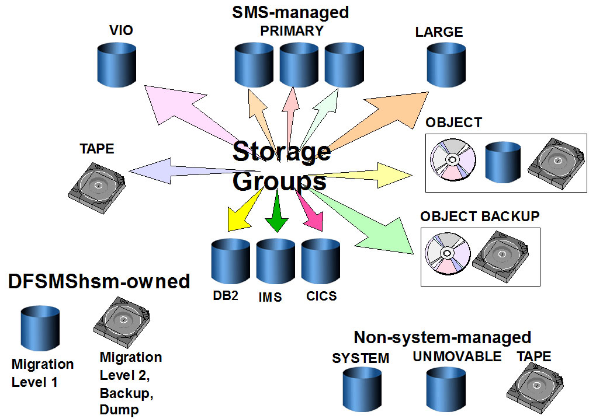

*図: SMS Storage Groups の分類 （出典: ABCs of z/OS Vol.03 (SG24-7978) p.111）*

#### 詳細手順

1. **ISMF 起動**
   ```
   TSO> ISMF
   ```

2. **Storage Class 定義（メニュー 5）**
   - Name: SCSSD
   - Sustained Data Rate: 高
   - Initial Access Response Seconds: 0
   - 関連 storage group 指定

3. **ACS routine（Storage Class）修正**
   ```
   IF &DSN(2) EQ 'PROD' THEN
     SET &STORCLAS = 'SCSSD'
   ELSE
     SET &STORCLAS = 'SCSTD'
   ```

4. **SCDS validate / activate**
   ISMF メニュー 8 → CDS 操作。

5. **動的反映**
   activate 後即時反映。

6. **確認**
   ```
   D SMS,STORCLAS(SCSSD)
   ```

7. **テストデータセット allocate**
   ```jcl
   //TEST   DD DSN=PROD.NEW.DATA,DISP=(NEW,CATLG),...
   ```
   LISTC で STORCLAS=SCSSD 確認。


#### 検証

新規 PROD.* allocate で SCSSD 適用、対象 storage group の volume に配置。

#### バリエーション

Data Class（DCB 属性）/ Management Class（HSM ポリシー）も同様 ISMF で定義。

#### 注意点

ACS routine 変更は VALIDATE / TEST 必須。本番 activate 前にテスト環境確認。

#### 関連ユースケース

[uc-vsam-define](#uc-vsam-define)

**出典**: S_ZOS_DFSMS

---

### HSM マイグレ済データセットを RECALL { #uc-dfsms-hsm-recall }

**ID**: `uc-dfsms-hsm-recall` / **カテゴリ**: DFSMS

#### 想定状況

HSM で ML2（テープ）にマイグ済のデータセットを DASD に呼び戻して使いたい。

#### 前提条件

- DFSMShsm 権限


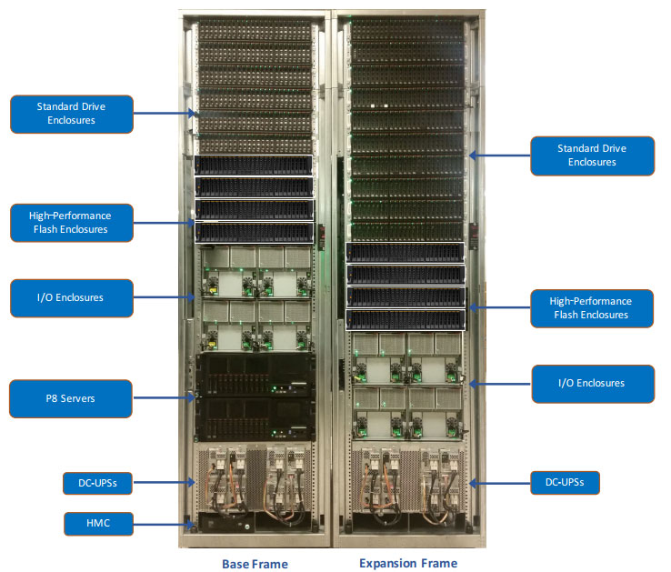

*図: DFSMShsm の Migration Level 1/2 と Backup の階層 （出典: ABCs of z/OS Vol.03 (SG24-7978) p.159）*

#### 詳細手順

1. **マイグ状態確認**
   ```
   LISTC ENTRIES(USER01.OLD.DATA) ALL
   ```
   出力に `MIGRATED` と表示。

2. **RECALL 実行**
   TSO で:
   ```
   HSEND WAIT RECALL USER01.OLD.DATA
   ```
   または非同期:
   ```
   HSEND RECALL USER01.OLD.DATA
   ```

3. **完了確認**
   ```
   HSEND QUERY USER('USER01')
   ```
   または LISTC で `MIGRATED` 消失確認。

4. **アプリでアクセス**
   通常データセットとして OPEN 可能。


#### 検証

LISTC で MIGRATED 表示なし、READ アクセス成功。

#### バリエーション

HMIGRATE で明示マイグ。HBACKDS でバックアップ。HRECOVER でバックアップから回復。

#### 注意点

ML1 = DASD（圧縮）、ML2 = テープ。RECALL は ML2 からだと数分〜要する。

#### 関連ユースケース

[uc-vsam-define](#uc-vsam-define)

**出典**: S_ZOS_DFSMS

---

## Sysplex

### CFRM Policy 更新（CF structure 追加） { #uc-sysplex-cfrm-update }

**ID**: `uc-sysplex-cfrm-update` / **カテゴリ**: Sysplex

#### 想定状況

Db2 Group Buffer Pool 等の CF structure を追加して Sysplex 全体に反映したい。

#### 前提条件

- Sysplex 管理権限
- CDS 容量


*図: Parallel Sysplex の構成（CF / XCF / CDS） （出典: ABCs of z/OS Vol.05 (SG24-7980) p.18）*


*図: Sysplex Couple Data Set（XCF / CFRM / SFM / LOGR / WLM） （出典: ABCs of z/OS Vol.05 (SG24-7980) p.20）*

#### 詳細手順

1. **現状 CFRM Policy 確認**
   ```
   D XCF,POLICY,TYPE=CFRM
   D XCF,STR
   ```

2. **新 CFRM Policy 作成（IXCMIAPU）**
   ```jcl
   //POLDEF EXEC PGM=IXCMIAPU
   //SYSPRINT DD SYSOUT=*
   //SYSIN DD *
     DATA TYPE(CFRM)
       DEFINE POLICY NAME(POLICY01) REPLACE(YES)
         CF NAME(CF01) TYPE(009672) MFG(IBM) ...
         STRUCTURE NAME(DSN_GBP1) SIZE(50000) PREFLIST(CF01)
   ```

3. **Policy 活性化**
   ```
   SETXCF START,POLICY,POLNAME=POLICY01,TYPE=CFRM
   ```

4. **新 structure を活性化**
   ```
   SETXCF START,REBUILD,STRNAME=DSN_GBP1
   ```

5. **確認**
   ```
   D XCF,STR,STRNAME=DSN_GBP1
   ```


#### 検証

D XCF,STR で新 structure CONNECTED 表示。Db2 等のサブシステムから CONNECT。

#### バリエーション

REBUILD で structure 移動。DELETE で削除（事前に DISCONNECT 必要）。

#### 注意点

CFRM Policy は IXCL1DSU で format した CDS に保存。複数 POLICY を切替可能。

#### 関連ユースケース

[uc-grs-rnl-update](#uc-grs-rnl-update), [inc-sysplex-split](09-incident-procedures.md#inc-sysplex-split)

**出典**: S_ZOS_Sysplex

---

### GRS RNL（Resource Name List）更新 { #uc-grs-rnl-update }

**ID**: `uc-grs-rnl-update` / **カテゴリ**: Sysplex

#### 想定状況

RESERVE を発行している legacy リソースを SYSTEMS に変換して Sysplex 性能改善したい。

#### 前提条件

- Sysplex 管理権限


*図: GRS RING モードと STAR モードの構造比較（RNL の影響範囲） （出典: ABCs of z/OS Vol.05 (SG24-7980) p.309）*

#### 詳細手順

1. **現状 RNL 確認**
   ```
   D GRS,RNL,ALL
   ```

2. **GRSRNLxx 編集**
   SYS1.PARMLIB(GRSRNLxx):
   ```
   RNLDEF RNL(CON) TYPE(GENERIC)
          QNAME(MYRESV) RNAME(MYDS)
   RNLDEF RNL(SYS) TYPE(GENERIC)
          QNAME(MYRESV)
   ```
   - CON RNL = SYSTEMS Exclusion → SYSTEMS conversion
   - SYS RNL = SYSTEMS Inclusion (no conversion to RESERVE)

3. **動的反映**
   ```
   SET GRSRNL=xx
   ```

4. **確認**
   ```
   D GRS,RNL,ALL
   D GRS,CONTENTION
   ```


#### 検証

D GRS,RNL に新エントリ。RESERVE 発生回数減少（D GRS,SYSTEM,RES）。

#### バリエーション

RNL(EXCL) = SYSTEMS Exclusion → 個別 RESERVE 維持。

#### 注意点

GRS STAR モードで RNL 設計が性能直結。GRSRNL=EXCL すると全リソースが SYSTEMS（注意）。

#### 関連ユースケース

[cfg-grs-setup](08-config-procedures.md#cfg-grs-setup), [uc-sysplex-cfrm-update](#uc-sysplex-cfrm-update)

**出典**: S_ZOS_Sysplex

---

## WLM

### WLM Scheduling Environment 定義 { #uc-wlm-schenv-define }

**ID**: `uc-wlm-schenv-define` / **カテゴリ**: WLM

#### 想定状況

本番系 LPAR でのみ実行されるべきジョブを SCHENV で制御したい。

#### 前提条件

- WLM 管理者権限


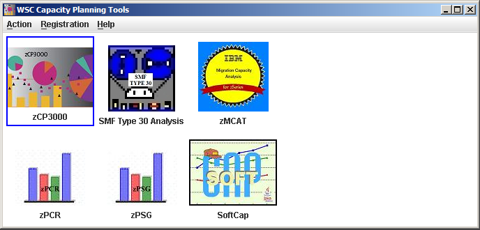

*図: WLM Service Class とトランザクションの関係（Scheduling Environment との対応） （出典: ABCs of z/OS Vol.11 (SG24-7986) p.49）*


*図: WLM External Service Class と Internal Service Class（管理単位）の関係 （出典: ABCs of z/OS Vol.12 (SG24-7987) p.137）*

#### 詳細手順

1. **WLM ISPF 起動**
   ```
   TSO> WLM
   ```
   または TSO のメニューから。

2. **Service Definition Read**

3. **Scheduling Environment 定義**
   - Name: PRODENV
   - Resource: PROD_RES (online/offline)

4. **特定 LPAR で resource を ONLINE**
   ```
   F WLM,RESOURCE=PROD_RES,STATE=ON
   ```

5. **JCL で SCHENV 指定**
   ```jcl
   //JOB1 JOB ...,CLASS=A,SCHENV=PRODENV
   ```

6. **確認**
   ```
   D WLM,SCHENV
   D WLM,RESOURCE
   ```


#### 検証

D WLM,SCHENV で SCHENV と Resource 状態表示。SCHENV=PRODENV のジョブが該当 LPAR で実行。

#### バリエーション

F WLM,RESOURCE=...,STATE=OFF で resource 切り替え（メンテ時等）。

#### 注意点

JES2 v2.5+ では JOBCLASS にも SCHENV 指定可能で、JCL 個別指定不要に。

#### 関連ユースケース

[uc-jes2-jobclass-define](#uc-jes2-jobclass-define), [cfg-wlm-policy](08-config-procedures.md#cfg-wlm-policy)

**出典**: S_ZOS_WLM

---


## 本記事の範囲

本ユースケース集は IBM z/OS 3.1 公式マニュアル記載の事実・手順のみで構成しています。AI が苦手な定性的判断は範囲外で、経験ある SME または IBM サポートにご確認ください。
